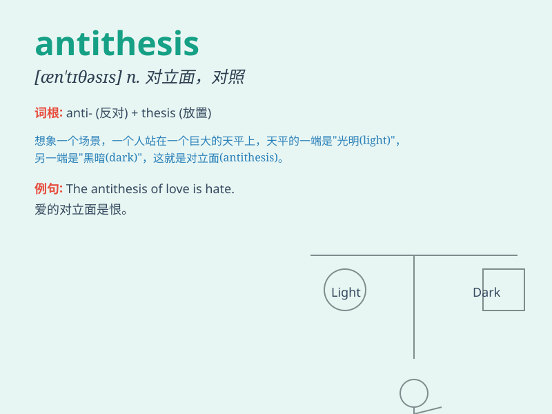

## antithesis

**英音:** _[æn\'tɪθəsɪs]_ **美音:** _[æn\'tɪθəsɪs]_

**译义:** *n.对立面*

### 短语

+ **in antithesis to:** _与\...\...相对照_

+ **set in antithesis:** _形成对比_

+ **be the antithesis of:** _是\...\...的对立面_

+ **present an antithesis:** _呈现出对比_

+ **antithesis between A and B:** _A 与 B 之间的对比_

### 例句

#### 例句1

> **Love is the antithesis of hate.**

**中文翻译:** 爱是恨的对立面。

**单词释义:** 对立面；对照；相反

#### 例句2

> **His view is the antithesis of mine.**

**中文翻译:** 他的观点与我的截然相反。

**单词释义:** 相反；对立

#### 例句3

> **The new policy is the antithesis of the previous one.**

**中文翻译:** 新政策与之前的政策完全相反。

**单词释义:** 相反；对立

### 背诵小故事

> Once upon a time, there were two kingdoms. One was peaceful and
prosperous, the other was chaotic and poor. These two kingdoms were the
antithesis of each other, showing completely opposite states.

**从前，有两个王国。一个和平繁荣，另一个混乱贫穷。这两个王国彼此对立，呈现出完全相反的状态。**

### 图义

