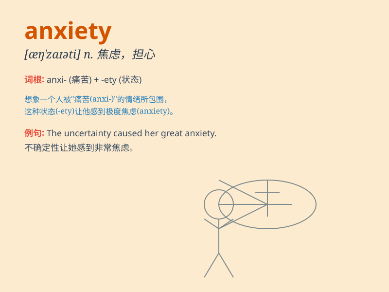

## anxiety

**英音:** _[æŋ\'zaɪətɪ]_ **美音:** _[æŋ\'zaɪəti]_

**译义:** *n.忧虑,焦急,渴望,热望*

### 短语

+ **anxiety disorder:** _焦虑症_

+ **generalized anxiety:** _广泛性焦虑_

+ **performance anxiety:** _表现焦虑；作业焦虑_

+ **social anxiety:** _社交焦虑_

+ **test anxiety:** _考试焦虑_

### 例句

#### 例句1

> **Her anxiety about the exam was palpable.**

**中文翻译:** 她对考试的焦虑是显而易见的。

**单词释义:** 焦虑；忧虑

#### 例句2

> **He suffered from anxiety and insomnia.**

**中文翻译:** 他患有焦虑症和失眠症。

**单词释义:** 焦虑；不安

#### 例句3

> **The economic situation is causing widespread anxiety.**

**中文翻译:** 经济形势正引起普遍的焦虑。

**单词释义:** 焦虑；担忧

### 背诵小故事

> A little mouse was always in a state of anxiety because it was afraid
of the big cat. It worried day and night. But finally, it learned to be
brave and face its fears. \'Anxiety\' is like the mouse\'s constant
worry.

**一只小老鼠总是处于焦虑的状态，因为它害怕大猫。它日夜担忧。但最后，它学会了勇敢，面对自己的恐惧。\'anxiety\'就像这只老鼠一直以来的担忧。**

### 图义

