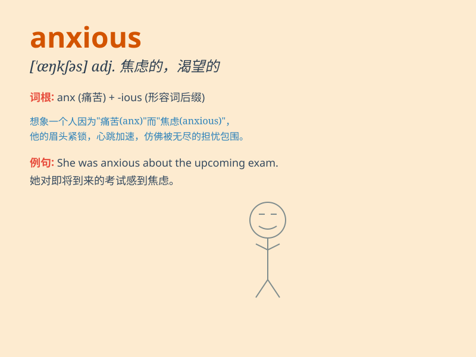

## anxious

**英音:** _[\'æŋ(k)ʃəs]_ **美音:** _[\'æŋkʃəs]_

**译义:** *adj.观念的,担忧的,渴望的,盼望的*

### 短语

+ **be anxious about:** _为\...\...担忧；对\...\...感到焦虑_

+ **anxious moment:** _焦虑的时刻_

+ **anxious look:** _忧虑的神情_

+ **feel anxious:** _感到焦虑_

+ **anxious heart:** _焦虑的心_

### 例句

#### 例句1

> **She was anxious about her exam results.**

**中文翻译:** 她对考试成绩感到焦虑。

**单词释义:** 焦虑的；担忧的

#### 例句2

> **He is anxious to meet his new colleagues.**

**中文翻译:** 他急于见到他的新同事。

**单词释义:** 渴望的；急切的

#### 例句3

> **The parents were anxious for their child\'s safety.**

**中文翻译:** 家长们非常担心孩子的安全。

**单词释义:** 担心的；忧虑的

### 背诵小故事

> One day, Tom had an important exam. He was very anxious before it. He
kept thinking if he could pass. But in the end, with his hard work, he
did well. Anxious means feeling worried or nervous.

**一天，汤姆有一场重要的考试。考试前他非常焦虑。他一直在想自己是否能通过。但最后，通过他的努力，他考得很好。anxious
意思是感到担心或紧张。**

### 图义

