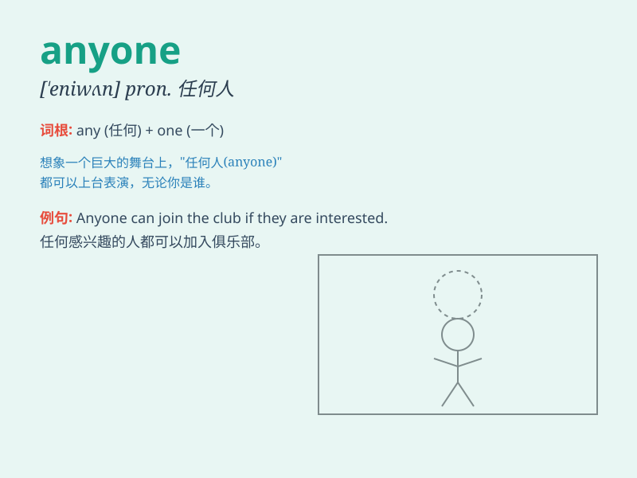

## anyone

**英音:** _[\'enɪwʌn]_ **美音:** _[\'ɛnɪ\'wʌn]_

**译义:** * pron.任何一个*

### 短语

+ **anyone else:** _其他任何人_

+ **anyone of:** _......中的任何一个_

+ **not anyone:** _不是任何人_

+ **if anyone:** _如果有人_

+ **hardly anyone:** _几乎没有人_

### 例句

#### 例句1

> **Is there anyone at home?**

**中文翻译:** 家里有人吗？

**单词释义:** 任何人

#### 例句2

> **Anyone can make mistakes.**

**中文翻译:** 任何人都可能犯错误。

**单词释义:** 任何人

#### 例句3

> **She never tells anyone her secrets.**

**中文翻译:** 她从不告诉任何人她的秘密。

**单词释义:** 任何人

### 背诵小故事

> One day, a group of friends were lost in a forest. They needed help.
But no one knew if anyone would come to rescue them. Finally, a kind
ranger appeared and saved them all.

**一天，一群朋友在森林里迷路了。他们需要帮助。但没人知道是否会有人来救他们。最后，一位善良的护林员出现并救了他们所有人。**

### 图义

