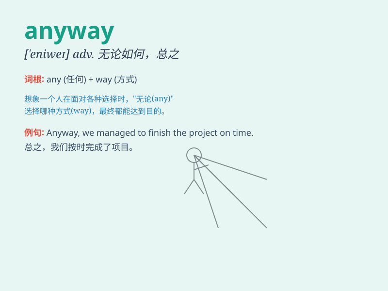

## anyway

**英音:** _[\'enɪweɪ]_ **美音:** _[\'ɛnɪ\'we]_

**译义:** *adv.无论如何,总之*

### 短语

+ **anyway at all:** _无论如何_

+ **anyway you like:** _随你喜欢_

+ **anyway possible:** _以任何可能的方式_

+ **anyway around:** _无论如何解决；不管怎样回避_

+ **anyway near:** _无论如何接近_

### 例句

#### 例句1

> **Anyway, let\'s forget about that for now.**

**中文翻译:** 无论如何，让我们暂时忘记这一点。

**单词释义:** 不管怎样；无论如何

#### 例句2

> **The water was cold but I took a shower anyway.**

**中文翻译:** 水很冷，但我还是洗了个澡。

**单词释义:** 尽管如此；仍然

#### 例句3

> **I\'m not feeling well. Anyway, I have to go to work.**

**中文翻译:** 我感觉不舒服。无论如何，我得去上班了。

**单词释义:** 无论如何；反正

### 背诵小故事

> One day, I was lost in a strange city. I had no map, but anyway, I
decided to keep walking and explore. Eventually, I found my way. It
means in any case or regardless of circumstances.

**有一天，我在一个陌生的城市迷路了。我没有地图，但不管怎样，我决定继续走并探索。最终，我找到了路。它的意思是无论如何，不管怎样。**

### 图义

