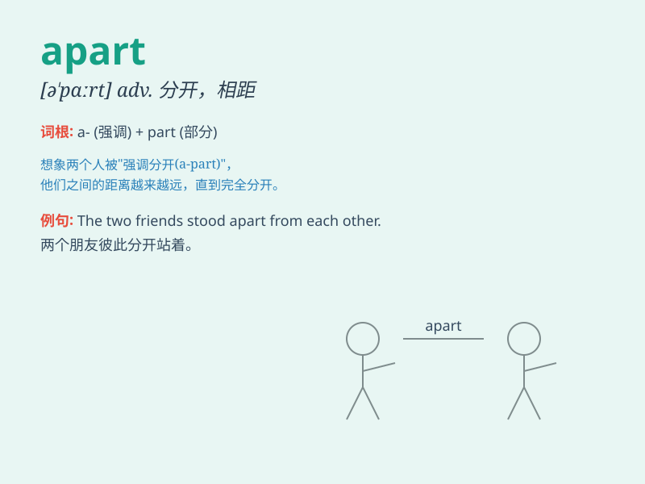

## apart

**英音:** _[ə\'pɑːt]_ **美音:** _[ə\'pɑrt]_

**译义:** *adv.分离,分成零件,分别地,分离着adj.分开的*

### 短语

+ **fall apart:** _破裂；破碎；崩溃_

+ **come apart:** _破碎；散开；崩溃_

+ **set apart:** _使与众不同；使突出_

+ **tell apart:** _区分；辨别_

+ **apart from:** _除了\...之外；远离_

### 例句

#### 例句1

> **The couple is drifting apart.**

**中文翻译:** 夫妻俩渐行渐远。

**单词释义:** 分开；分离

#### 例句2

> **The two houses stand apart from each other.**

**中文翻译:** 两栋房子彼此分开。

**单词释义:** 相隔；相距

#### 例句3

> **She took the toy apart to see how it worked.**

**中文翻译:** 她把玩具拆开看看它是如何工作的。

**单词释义:** 拆开；分解

### 背诵小故事

> A couple was forced to live apart due to a job transfer. The distance
made them sad. But they still kept in touch. \'Apart\' means separated
or not together.

**一对夫妻因为工作调动被迫分开居住。距离让他们难过。但他们仍保持联系。\'apart\'意思是分离的、不在一起的。**

### 图义

