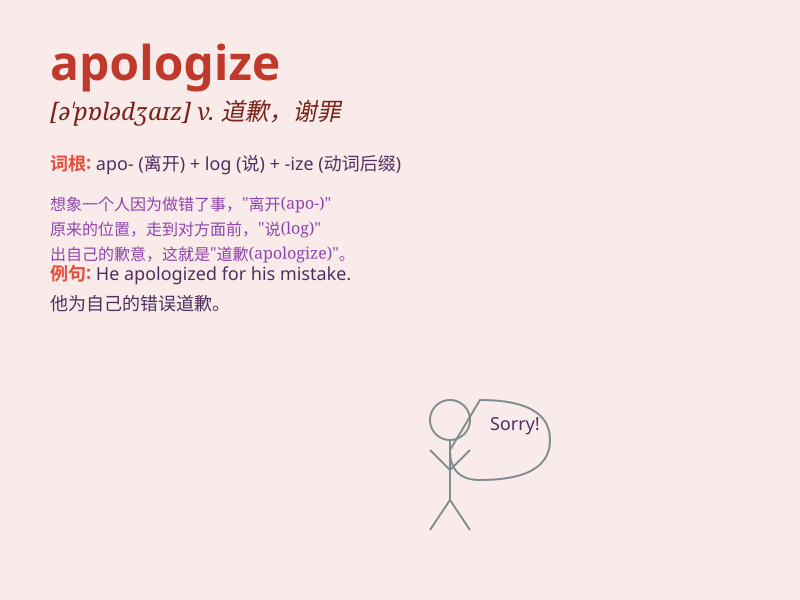

## apologize

**英音:** _[ə\'pɒlədʒaɪz]_ **美音:** _[ə\'pɑlədʒaɪz]_

**译义:** *vi.道歉,辩白*

### 短语

+ **apologize to:** _向\...\...道歉_

+ **apologize for:** _为\...\...道歉；因\...\...而道歉_

+ **apologize sincerely:** _真诚地道歉_

+ **apologize profusely:** _一再道歉；深表歉意_

+ **apologize humbly:** _谦卑地道歉_

### 例句

#### 例句1

> **I apologize for my mistake.**

**中文翻译:** 我为我的错误道歉。

**单词释义:** 道歉

#### 例句2

> **He had to apologize sincerely to regain her trust.**

**中文翻译:** 他不得不真诚地道歉以重新获得她的信任。

**单词释义:** 道歉

#### 例句3

> **You should apologize to him immediately.**

**中文翻译:** 你应该马上向他道歉。

**单词释义:** 道歉

### 背诵小故事

> One day, Tom accidentally broke his sister\'s favorite toy. Feeling
very sorry, he decided to apologize. He looked into his sister\'s eyes
and said, \'I\'m sorry for breaking your toy.\' His sister forgave him
because of his sincere apology.

**有一天，汤姆不小心弄坏了妹妹最喜欢的玩具。感到非常抱歉，他决定道歉。他看着妹妹的眼睛说：'我很抱歉弄坏了你的玩具。'因为他诚恳的道歉，妹妹原谅了他。**

### 图义

