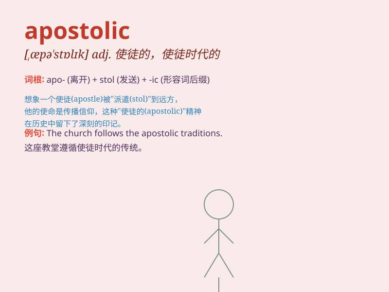

## apostolic

**英音:** _[,æpə\'stɒlɪk]_ **美音:** _[,æpə\'stɑlɪk]_

**译义:** *adj.使徒的*

### 短语

+ **apostolic succession:** _使徒统绪_

+ **apostolic see:** _宗座_

+ **apostolic delegate:** _宗座代表_

+ **apostolic nuncio:** _宗座大使_

+ **apostolic mission:** _使徒使命_

### 例句

#### 例句1

> **The church has an apostolic mission to spread the gospel.**

**中文翻译:** 这座教堂有传播福音的使徒使命。

**单词释义:** 使徒的；与使徒有关的

#### 例句2

> **His teachings were based on the apostolic traditions.**

**中文翻译:** 他的教导基于使徒传统。

**单词释义:** 使徒的；与使徒有关的

#### 例句3

> **The apostolic succession is an important concept in some
religious denominations.**

**中文翻译:** 使徒传承在某些宗教教派中是一个重要的概念。

**单词释义:** 使徒的；与使徒有关的

### 背诵小故事

> Once upon a time, a wise apostle traveled far and wide to spread the
divine message. His work was considered apostolic, full of sacredness
and authority. People respected his mission and followed his teachings.

**从前，一位睿智的使徒四处游历去传播神圣的信息。他的工作被认为是使徒的，充满了神圣和权威。人们尊重他的使命并遵循他的教诲。**

### 图义

