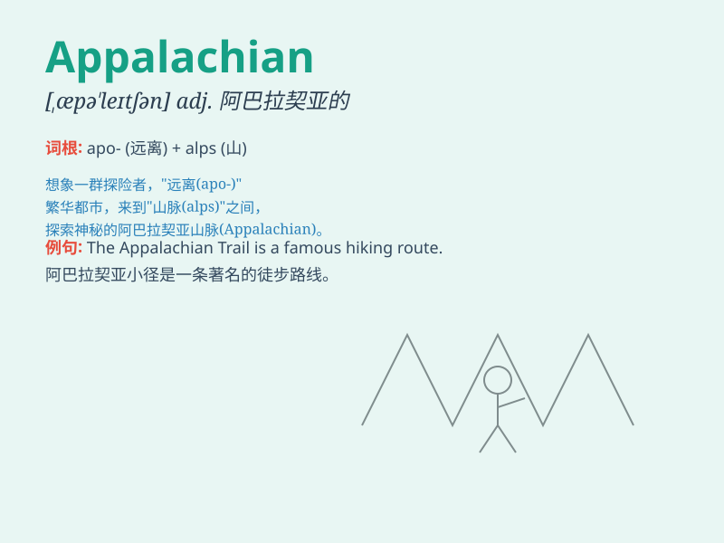

## Appalachian

**英音:** _[ˌæpəˈleɪtʃɪən]_ **美音:** _[ˌæpəˈleɪtʃɪən]_

**译义:**
*adj.阿巴拉契亚山脉的；阿巴拉契亚地区的；n.阿巴拉契亚山脉居民*

### 短语

+ **Appalachian Mountains:** _阿巴拉契亚山脉_

+ **Appalachian Trail:** _阿巴拉契亚小径_

+ **Appalachian Region:** _阿巴拉契亚地区_

+ **Appalachian Culture:** _阿巴拉契亚文化_

+ **Appalachian Folk Music:** _阿巴拉契亚民间音乐_

### 例句

#### 例句1

> **The Appalachian Mountains are a beautiful sight to behold.**

**中文翻译:** 阿巴拉契亚山脉是一处美丽的景观，值得一看。

**单词释义:** 阿巴拉契亚山脉（指特定的山脉名称）

#### 例句2

> **She has a deep love for the Appalachian culture.**

**中文翻译:** 她深深地热爱着阿巴拉契亚文化。

**单词释义:** 阿巴拉契亚（与该地区相关的）

#### 例句3

> **The Appalachian Trail attracts many hikers every year.**

**中文翻译:** 阿巴拉契亚小径每年吸引着许多徒步旅行者。

**单词释义:** 阿巴拉契亚（与相关路径或路线有关）

### 背诵小故事

> A brave adventurer was hiking in the Appalachian Mountains. He got
lost but finally found his way by following a special mark. The
Appalachian became a symbol of his perseverance and adventure.

**一位勇敢的冒险家在阿巴拉契亚山脉徒步旅行。他迷路了，但最终通过一个特殊的标记找到了路。阿巴拉契亚成为了他坚持不懈和冒险的象征。**

### 图义

