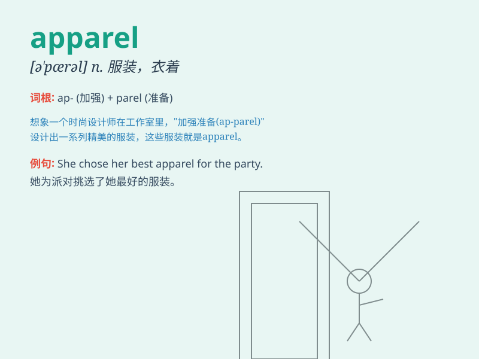

## apparel

**英音:** _[ə\'pær(ə)l]_ **美音:** _[ə\'pærəl]_

**译义:** *n.衣服,装饰*

### 短语

+ **apparel industry:** _服装业_

+ **sports apparel:** _运动服装_

+ **fashionable apparel:** _时尚服装_

+ **work apparel:** _工作服_

+ **apparel store:** _服装店_

### 例句

#### 例句1

> **The store sells a wide range of apparel for men, women, and
children.**

**中文翻译:** 这家商店出售各种男士、女士和儿童服装。

**单词释义:** 服装；衣服

#### 例句2

> **She always wears fashionable apparel to parties.**

**中文翻译:** 她总是穿着时髦的衣服参加聚会。

**单词释义:** 服装；服饰

#### 例句3

> **The company is a major supplier of sports apparel.**

**中文翻译:** 该公司是运动服装的主要供应商。

**单词释义:** 服装；衣着用品

### 背诵小故事

> A poor girl had only old and shabby apparel. But one day, a fairy
gave her beautiful new clothes. She wore the fine apparel and felt
confident. Now she knew good apparel can change how you feel.

**一个贫穷的女孩只有又旧又破的衣服。但有一天，一个仙女给了她漂亮的新衣服。她穿着精美的服装，感到自信。现在她知道好的服装能改变你的感觉。**

### 图义

