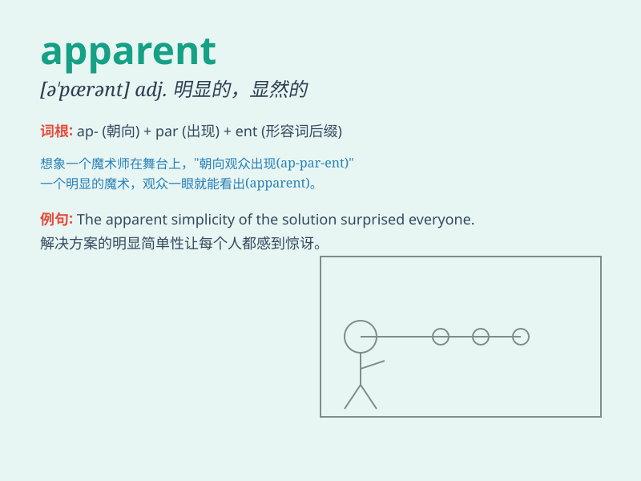

## apparent

**英音:** _[ə\'pær(ə)nt]_ **美音:** _[ə\'pærənt]_

**译义:** *adj.显然的,外观上的*

### 短语

+ **apparent cause:** _明显的原因_

+ **apparent contradiction:** _明显的矛盾_

+ **apparent success:** _表面上的成功_

+ **apparent simplicity:** _表面上的简单_

+ **apparent change:** _明显的变化_

### 例句

#### 例句1

> **It was apparent that she was very angry.**

**中文翻译:** 看得出来，她非常生气。

**单词释义:** 明显的

#### 例句2

> **The apparent cause of the accident was a faulty brake.**

**中文翻译:** 事故的明显原因是刹车故障。

**单词释义:** 表面上的；显然的

#### 例句3

> **His apparent calmness deceived us all.**

**中文翻译:** 他表面上的冷静欺骗了我们所有人。

**单词释义:** 表面上的；貌似的

### 背诵小故事

> A man was lost in a forest. It was apparent that he needed help. But
he refused to show his fear. Finally, a rescue team found him.
\'Apparent\' here means clearly visible or obvious.

**一个男人在森林里迷路了。很明显他需要帮助。但他拒绝表现出害怕。最后，一支救援队找到了他。'apparent'在这里指清晰可见的或明显的。**

### 图义

