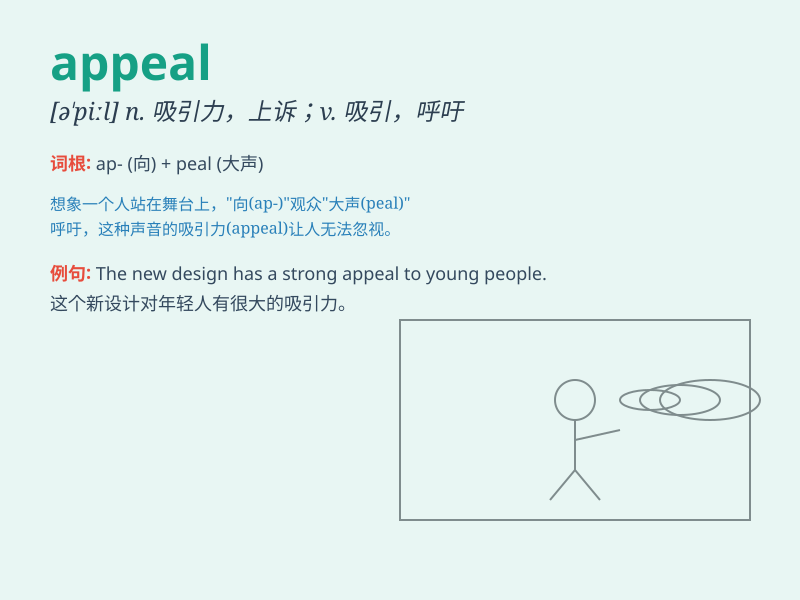

## appeal

**英音:** _[ə\'piːl]_ **美音:** _[ə\'pil]_

**译义:** *n.请求,呼吁,上诉,吸引力,要求;vi.求助,诉请,要求;vt.控诉*

### 短语

+ **appeal to:** _对\...\...有吸引力；向\...\...呼吁_

+ **lodge an appeal:** _提出上诉_

+ **make an appeal:** _发出呼吁_

+ **lose an appeal:** _上诉失败_

+ **winning appeal:** _吸引人的魅力_

### 例句

#### 例句1

> **The new movie has wide appeal for audiences of all ages.**

**中文翻译:** 这部新电影对各个年龄段的观众都有广泛的吸引力。

**单词释义:** 吸引力

#### 例句2

> **She decided to appeal the court\'s decision.**

**中文翻译:** 她决定对法院的判决提出上诉。

**单词释义:** 上诉

#### 例句3

> **The charity\'s appeal for donations has received a great
response.**

**中文翻译:** 慈善机构的捐款呼吁得到了热烈响应。

**单词释义:** 呼吁

### 背诵小故事

> A poor man was wrongly accused of a crime. He made an appeal to the
judge, saying he was innocent. His sincere words and desperate look
finally made the judge reconsider. Appeal means to make a serious and
urgent request.

**一个穷人被错误地指控犯罪。他向法官上诉，称自己是无辜的。他真诚的话语和绝望的神情最终让法官重新考虑。appeal
意思是呼吁；申诉；上诉**

### 图义

