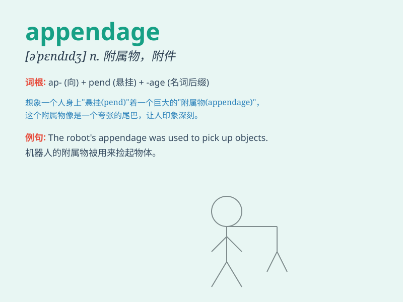

## appendage

**英音:** _[ə\'pendɪdʒ]_ **美音:** _[ə\'pɛndɪdʒ]_

**译义:** *n.附加物,附属肢体*

### 短语

+ **appendage organ:** _附属器官_

+ **artificial appendage:** _人造附属物_

+ **small appendage:** _小的附属肢体_

+ **animal appendage:** _动物的附属肢体_

+ **body appendage:** _身体附属部分_

### 例句

#### 例句1

> **The lobster\'s appendages moved gracefully in the water.**

**中文翻译:** 龙虾的附肢在水中优雅地移动。

**单词释义:** 附肢；附加物

#### 例句2

> **The robot has various appendages for different tasks.**

**中文翻译:** 该机器人具有用于不同任务的各种附件。

**单词释义:** 附加部件

#### 例句3

> **The insect\'s appendages were damaged in the fight.**

**中文翻译:** 这只昆虫的附肢在战斗中受损。

**单词释义:** 附肢

### 背诵小故事

> 想象一只章鱼，它的触手就是
appendage。这些触手帮助它捕食、移动和感知周围环境。章鱼没有触手就无法正常生活，就像物体没有
appendage 就不完整。

**想象一只章鱼，它的触手就是附属物。这些触手帮助它捕食、移动和感知周围环境。章鱼没有触手就无法正常生活，就像物体没有附属物就不完整。**

### 图义

