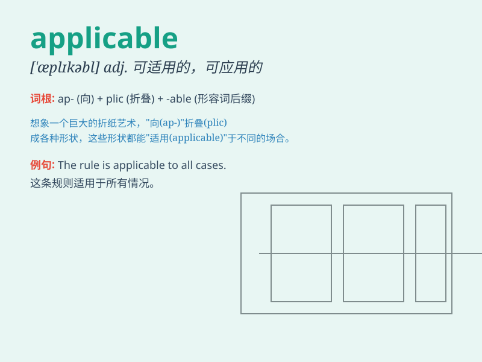

## applicable

**英音:** _[ə\'plɪkəb(ə)l; \'æplɪk-]_ **美音:**
_[\'æplɪkəbl]_

**译义:** *adj.可适用的,可应用的*

### 短语

+ **be applicable to:** _适用于_

+ **applicable law:** _适用的法律_

+ **applicable rules:** _适用的规则_

+ **applicable scope:** _适用范围_

+ **applicable conditions:** _适用条件_

### 例句

#### 例句1

> **This rule is applicable to all employees.**

**中文翻译:** 这条规则适用于所有员工。

**单词释义:** 适用于

#### 例句2

> **The law is not applicable in this case.**

**中文翻译:** 这项法律在这个案子中不适用。

**单词释义:** 适用

#### 例句3

> **These principles are widely applicable in daily life.**

**中文翻译:** 这些原则在日常生活中广泛适用。

**单词释义:** 适用

### 背诵小故事

> A student was confused about which rules were applicable to his
project. But when he carefully read the instructions, he found the
applicable ones and completed the task successfully.

**一名学生对哪些规则适用于他的项目感到困惑。但当他仔细阅读说明时，他找到了适用的规则并成功完成了任务。**

### 图义

