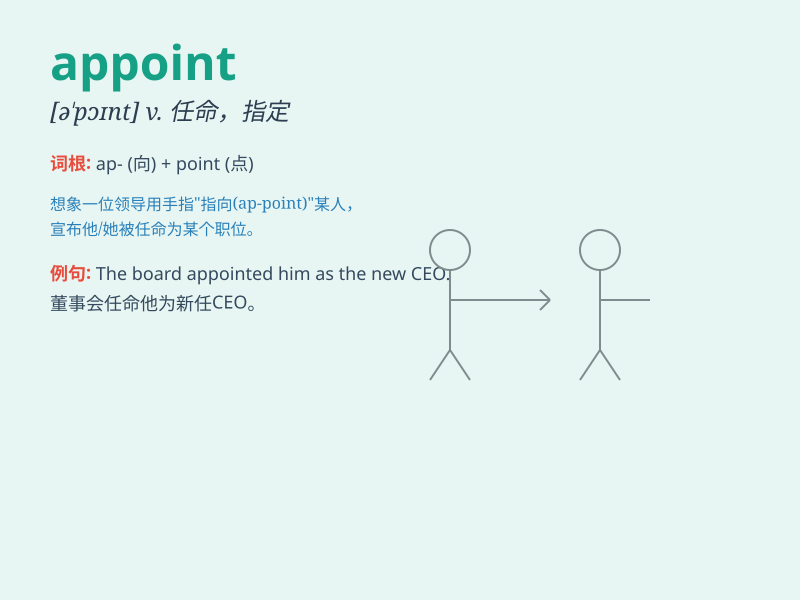

## appoint

**英音:** _[ə\'pɒɪnt]_ **美音:** _[ə\'pɔɪnt]_

**译义:** *vt.约定,指定(时间,地点),任命,委任*

### 短语

+ **appoint sb to a position:** _任命某人担任某职位_

+ **appoint a time:** _指定时间_

+ **appoint a committee:** _任命一个委员会_

+ **appoint a date:** _约定日期_

+ **appoint an agent:** _指定代理人_

### 例句

#### 例句1

> **The company appointed a new CEO last month.**

**中文翻译:** 公司上个月任命了一位新的首席执行官。

**单词释义:** 任命

#### 例句2

> **We need to appoint a time for the meeting.**

**中文翻译:** 我们需要为会议指定一个时间。

**单词释义:** 指定

#### 例句3

> **The judge was appointed by the president.**

**中文翻译:** 这位法官是由总统任命的。

**单词释义:** 任命

### 背诵小故事

> A king needed to appoint a new general. He had many candidates.
Finally, he chose the bravest one. The act of choosing the general is
like appointing someone to a position.

**一位国王需要任命一位新将军。他有很多候选人。最终，他选择了最勇敢的那个。选择将军的这个行为就像是任命某人担任某个职位。**

### 图义

