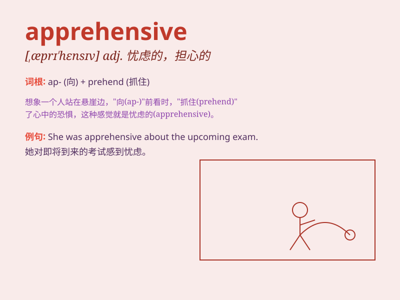

## apprehensive

**英音:** _[æprɪ\'hensɪv]_ **美音:** _[,æprɪ\'hɛnsɪv]_

**译义:** *adj.有理解力的*

### 短语

+ **be apprehensive about:** _对\...\...感到忧虑_

+ **apprehensive look:** _忧虑的神情_

+ **apprehensive mood:** _忧虑的心情_

+ **apprehensive thoughts:** _忧虑的想法_

+ **feel apprehensive:** _感到忧虑_

### 例句

#### 例句1

> **I\'m rather apprehensive about the interview tomorrow.**

**中文翻译:** 我对明天的面试相当担心。

**单词释义:** 担心的；忧虑的

#### 例句2

> **The child was apprehensive of going to a new school.**

**中文翻译:** 这孩子害怕去新学校。

**单词释义:** 害怕的；恐惧的

#### 例句3

> **He was apprehensive that he might fail the exam.**

**中文翻译:** 他担心自己可能考试不及格。

**单词释义:** 担忧的；不安的

### 背诵小故事

> A thief was trying to break into a house. The owner, feeling
apprehensive, called the police immediately. He was worried and anxious
about what might happen. So, \'apprehensive\' means feeling worried or
anxious.

**一个小偷正试图闯入一所房子。房子的主人感到担忧害怕，立即报了警。他对可能发生的事情感到担心和焦虑。所以，\'apprehensive\'意思是担忧的，焦虑的。**

### 图义

