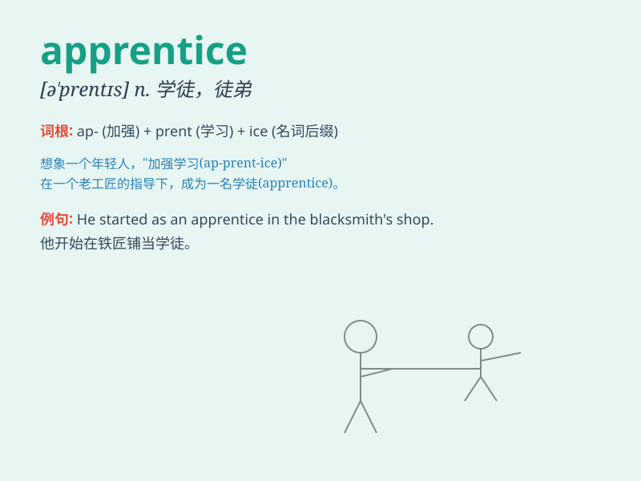

## apprentice

**英音:** _[ə\'prentɪs]_ **美音:** _[ə\'prɛntɪs]_

**译义:** *n.学徒v.当学徒*

### 短语

+ **apprentice chef:** _学徒厨师_

+ **apprentice plumber:** _学徒水管工_

+ **apprentice carpenter:** _学徒木匠_

+ **apprentice electrician:** _学徒电工_

+ **apprentice hairdresser:** _学徒美发师_

### 例句

#### 例句1

> **The apprentice is learning the trade from a master craftsman.**

**中文翻译:** 这个学徒正在向一位工匠大师学习手艺。

**单词释义:** 学徒

#### 例句2

> **She started as an apprentice in the law firm.**

**中文翻译:** 她在这家律师事务所从学徒做起。

**单词释义:** 学徒；徒弟

#### 例句3

> **The young apprentice showed great potential in the field of
design.**

**中文翻译:** 这位年轻的学徒在设计领域展现出巨大的潜力。

**单词释义:** 学徒；新手

### 背诵小故事

> A young boy was eager to learn a trade. He became an apprentice to a
master craftsman. Every day, he followed the master closely, learning
skills and tricks. Through hard work and dedication, he hoped to become
a master himself one day.

**一个年轻的男孩渴望学习一门手艺。他成为了一位工匠大师的学徒。每天，他紧紧跟随着大师，学习技能和窍门。通过努力和专注，他希望有一天自己也能成为大师。**

### 图义

