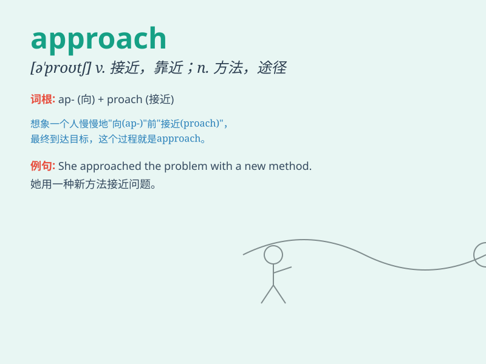

## approach

**英音:** _[ə\'prəʊtʃ]_ **美音:** _[ə\'protʃ]_

**译义:**
*n.接近,逼近,走进,方法,步骤,途径,通路vt.接近,动手处理vi.靠近*

### 短语

+ **approach to:** _接近；约等于；通往......的方法_

+ **approach sb. about sth.:** _与某人接洽某事_

+ **new approach:** _新方法；新途径_

+ **make an approach:** _进行尝试；着手处理_

+ **easy approach:** _容易接近；容易到达_

### 例句

#### 例句1

> **As we approached the house, we noticed the beautiful garden.**

**中文翻译:** 当我们接近那所房子时，我们注意到了那个美丽的花园。

**单词释义:** 接近；靠近

#### 例句2

> **She has a unique approach to solving this problem.**

**中文翻译:** 她有解决这个问题的独特方法。

**单词释义:** 方法；途径

#### 例句3

> **The winter is approaching. We need to prepare warm clothes.**

**中文翻译:** 冬天即将来临。我们需要准备暖和的衣服。

**单词释义:** 临近；来临

### 背诵小故事

> A brave explorer was lost in a forest. As night approached, he
decided to follow a river, hoping it would lead him to safety. Finally,
he found a village, approaching it with joy. The way he got closer to
the village is like the meaning of \'approach\'.

**一位勇敢的探险家在森林里迷路了。当夜晚临近时，他决定沿着一条河走，希望能通向安全之地。最后，他发现了一个村庄，高兴地靠近它。他靠近村庄的方式就像\'approach\'这个单词的意思。**

### 图义

