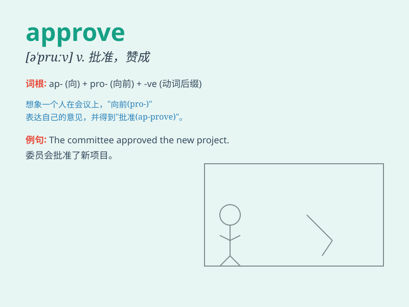

## approve

**英音:** _[ə\'pruːv]_ **美音:** _[ə\'prʊv]_

**译义:** *vi.赞成,满意vt.批准,通过v.批准*

### 短语

+ **approve of:** _赞成；同意_

+ **approve oneself:** _证明自己是_

+ **approve the plan:** _批准计划_

+ **approve the budget:** _批准预算_

+ **approve the proposal:** _批准提议_

### 例句

#### 例句1

> **The committee approved the new policy.**

**中文翻译:** 委员会批准了新政策。

**单词释义:** 批准

#### 例句2

> **I don\'t approve of your behavior.**

**中文翻译:** 我不赞成你的行为。

**单词释义:** 赞成

#### 例句3

> **She approved the design of the building.**

**中文翻译:** 她批准了这座建筑的设计。

**单词释义:** 认可

### 背诵小故事

> A young artist submitted his painting. The jury members carefully
examined it and finally gave a nod of approval. It meant they thought
his work was good and acceptable.

**一位年轻的艺术家提交了他的画作。评审团成员仔细审查后，最终点头表示认可。这意味着他们认为他的作品很好，是可以接受的。**

### 图义

