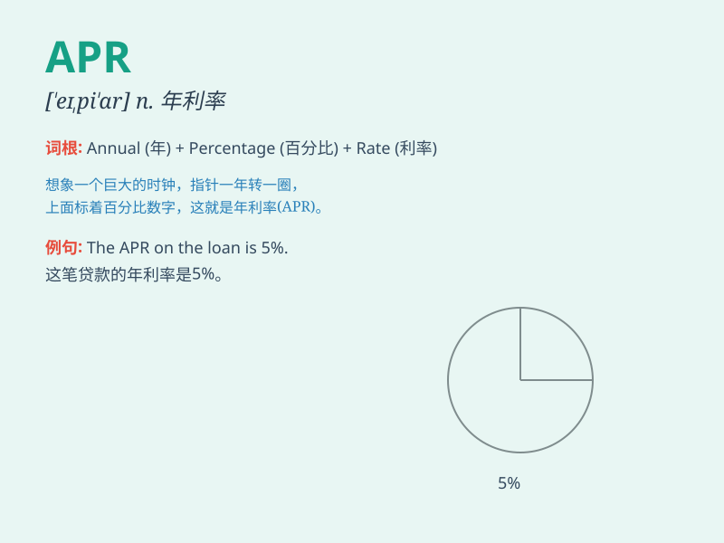

## APR

**英音:** _[ˌeɪ piː ˈɑː(r)]_ **美音:** _[ˌeɪ piː ˈɑːr]_

**译义:** *abbr.四月(April)*

### 短语

+ **APR rate:** _年利率_

+ **APR calculator:** _年利率计算器_

+ **low APR:** _低年利率_

+ **APR disclosure:** _年利率披露_

+ **annual APR:** _年度年利率_

### 例句

#### 例句1

> **The APR on this credit card is quite high.**

**中文翻译:** 这张信用卡的年利率相当高。

**单词释义:** 年利率

#### 例句2

> **We need to compare the APRs of different loans before making a
decision.**

**中文翻译:** 在做决定之前，我们需要比较不同贷款的年利率。

**单词释义:** 年利率

#### 例句3

> **The APR for this mortgage is fixed for the first five years.**

**中文翻译:** 这个抵押贷款的年利率在前五年是固定的。

**单词释义:** 年利率

### 背诵小故事

> Alice planned a wonderful picnic in April (APR). The weather was
perfect, and she had a great time with her friends. Remember, APR is the
abbreviation for April, the month of fun and joy.

**爱丽丝计划在四月（APR）进行一次美妙的野餐。天气非常好，她和朋友们玩得很开心。记住，APR
是四月的缩写，是充满欢乐的月份。**

### 图义

