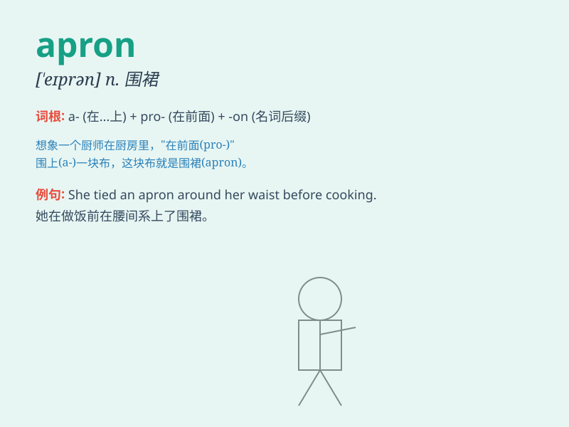

## apron

**英音:** _[\'eɪpr(ə)n]_ **美音:** _[\'eprən]_

**译义:** *n.围裙,外表或作用类似围裙的东西,[机]挡板,护坦*

### 短语

+ **apron string:** _围裙带_

+ **parking apron:** _停机坪_

+ **stage apron:** _舞台前沿_

+ **apron board:** _跳板_

+ **apron conveyor:** _裙式输送机_

### 例句

#### 例句1

> **She tied an apron around her waist before starting to cook.**

**中文翻译:** 她在腰上系了一条围裙，然后开始做饭。

**单词释义:** 围裙

#### 例句2

> **The carpenter wore an apron to protect his clothes.**

**中文翻译:** 木匠系了一条围裙来保护他的衣服。

**单词释义:** 围裙

#### 例句3

> **The apron of the stage was filled with flowers.**

**中文翻译:** 舞台的围裙上摆满了鲜花。

**单词释义:** 台口

### 背诵小故事

> A little girl was playing in the kitchen. She accidentally spilled
juice on her dress. Her mother quickly put an apron on her to protect
her clothes. The apron was like a shield, keeping her clean.

**一个小女孩在厨房玩耍。她不小心把果汁洒在了裙子上。她妈妈迅速给她穿上一条围裙来保护她的衣服。围裙就像一个盾牌，让她保持干净。**

### 图义

