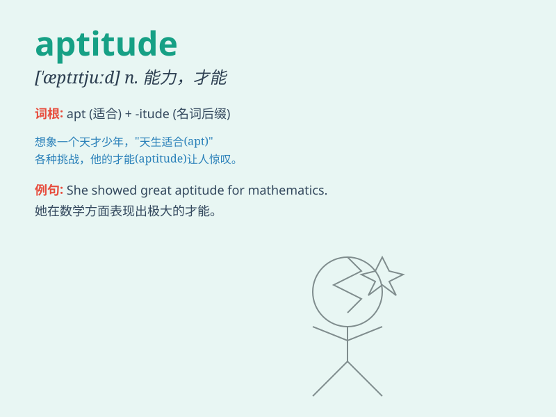

## aptitude

**英音:** _[\'æptɪtjuːd]_ **美音:** _[ˈæptɪˌtud,
-ˌtjud]_

**译义:** *n.恰当,智能,聪明,自然倾向*

### 短语

+ **aptitude test:** _能力倾向测验；才能测验_

+ **natural aptitude:** _天赋；天生的才能_

+ **have an aptitude for:** _有\...\...的才能；对\...\...有天赋_

+ **aptitude training:** _能力训练；才能培训_

+ **academic aptitude:** _学术能力；学业才能_

### 例句

#### 例句1

> **She has a remarkable aptitude for mathematics.**

**中文翻译:** 她具有非凡的数学天赋。

**单词释义:** 天赋

#### 例句2

> **His aptitude for languages enabled him to master several foreign
tongues easily.**

**中文翻译:** 他的语言天赋使他能够轻松掌握几种外语。

**单词释义:** 才能

#### 例句3

> **The test is designed to measure your aptitude for the job.**

**中文翻译:** 该测试旨在衡量您对该工作的能力。

**单词释义:** 适应能力

### 背诵小故事

> A young student named Tom had an aptitude for solving math problems.
Whenever there was a difficult equation, he could solve it quickly. His
aptitude made him stand out in the class.

**一个叫汤姆的年轻学生有解决数学问题的天资。每当有难题时，他都能很快解决。他的天资使他在班上脱颖而出。**

### 图义

