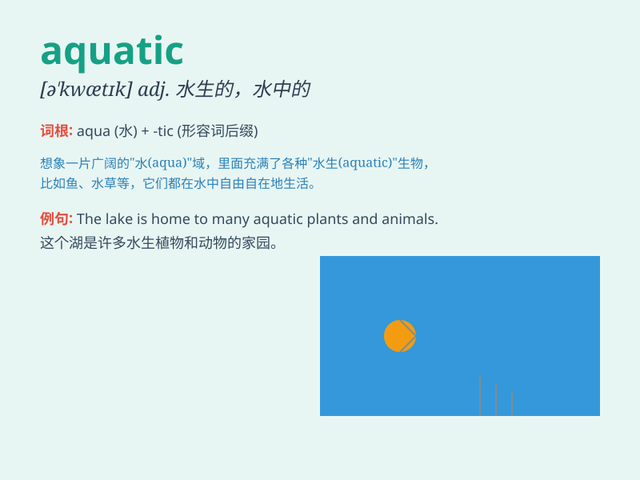

## aquatic

**英音:** _[ə\'kwætɪk; -\'kwɒt-]_ **美音:**
_[ə\'kwætɪk]_

**译义:** *adj.水的,水上的,水生的,水栖的*

### 短语

+ **aquatic sports:** _水上运动_

+ **aquatic life:** _水生生物_

+ **aquatic environment:** _水生环境_

+ **aquatic plants:** _水生植物_

+ **aquatic animals:** _水生动物_

### 例句

#### 例句1

> **The aquarium is home to a variety of aquatic creatures.**

**中文翻译:** 这个水族馆是各种水生物的家园。

**单词释义:** 水生的

#### 例句2

> **Aquatic sports like swimming and diving are very popular.**

**中文翻译:** 像游泳和跳水这样的水上运动非常受欢迎。

**单词释义:** 水上的

#### 例句3

> **The park has a beautiful aquatic area with lotus flowers.**

**中文翻译:** 这个公园有一个美丽的有荷花的水域。

**单词释义:** 水的；水中的

### 背诵小故事

> A cute fish was happily swimming in the aquatic world. It showed us
the beauty and mystery of the water. All the creatures in this aquatic
environment lived in harmony.

**一条可爱的鱼在水生世界里欢快地游着。它向我们展示了水的美丽和神秘。在这个水生环境中的所有生物都和谐共处。**

### 图义

