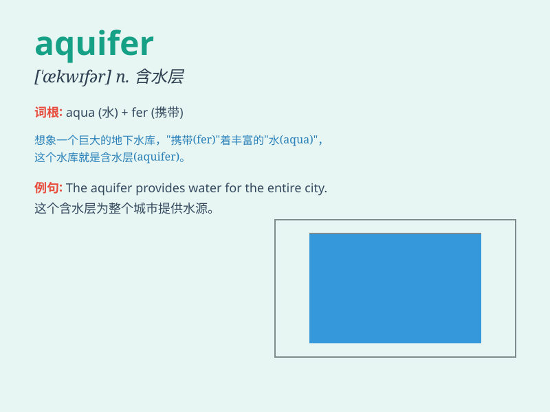

## aquifer

**英音:** _[\'ækwɪfə]_ **美音:** _[\'ækwɪfɚ]_

**译义:** *n.含水土层,蓄水层*

### 短语

+ **groundwater aquifer:** _地下含水层_

+ **porous aquifer:** _多孔含水层_

+ **confined aquifer:** _承压含水层_

+ **unconfined aquifer:** _无压含水层_

+ **aquifer recharge:** _含水层补给_

### 例句

#### 例句1

> **The region relies on the local aquifer for its water supply.**

**中文翻译:** 该地区依靠当地的含水层来供水。

**单词释义:** 含水层

#### 例句2

> **Scientists are studying the properties of the aquifer to better
manage water resources.**

**中文翻译:** 科学家们正在研究含水层的特性，以更好地管理水资源。

**单词释义:** 含水层

#### 例句3

> **Pollution has threatened the quality of the nearby aquifer.**

**中文翻译:** 污染已经威胁到附近含水层的质量。

**单词释义:** 含水层

### 背诵小故事

> Imagine a magical underground cave filled with clear water. This cave
is like an aquifer. It stores and supplies water to wells and springs.
People rely on it to get the precious water they need.

**想象一个充满清澈水流的神奇地下洞穴。这个洞穴就像含水层。它储存并向水井和泉眼供水。人们依靠它获取所需的珍贵水资源。**

### 图义

