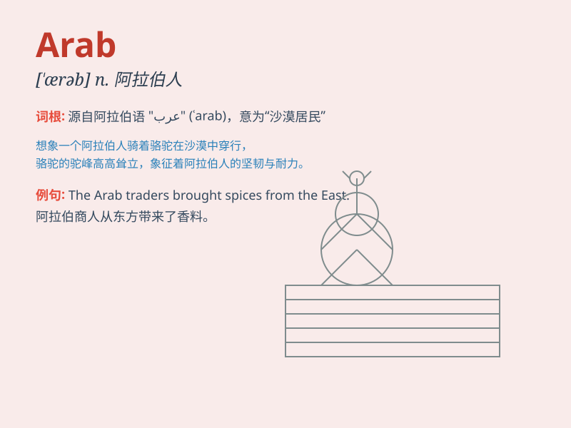

## Arab

**英音:** _[əˈræb]_ **美音:** _[əˈræb]_

**译义:** *n.阿拉伯人;阿拉伯语adj.阿拉伯的;阿拉伯人的*

### 短语

+ **Arab League:** _阿拉伯联盟_

+ **Arab Spring:** _阿拉伯之春_

+ **Arab Emirates:** _阿拉伯联合酋长国_

+ **Arab World:** _阿拉伯世界_

+ **Arabian Nights:** _《一千零一夜》；天方夜谭_

### 例句

#### 例句1

> **The Arab world has a rich cultural heritage.**

**中文翻译:** 阿拉伯世界有着丰富的文化遗产。

**单词释义:** 阿拉伯的；阿拉伯人的

#### 例句2

> **She has been studying Arab literature for years.**

**中文翻译:** 她研究阿拉伯文学多年了。

**单词释义:** 阿拉伯的

#### 例句3

> **The Arab merchants traded spices along the Silk Road.**

**中文翻译:** 阿拉伯商人沿着丝绸之路交易香料。

**单词释义:** 阿拉伯的

### 背诵小故事

>
想象一下，在炎热的沙漠中，有一群骑着骆驼的人。他们头戴头巾，身穿长袍，这就是
Arab 阿拉伯人。他们勇敢地穿越沙丘，带着神秘和独特的文化。

**想象在炎热沙漠中一群具有独特文化的阿拉伯人的情景，帮助记住'Arab
（阿拉伯人）'这个单词。**

### 图义

