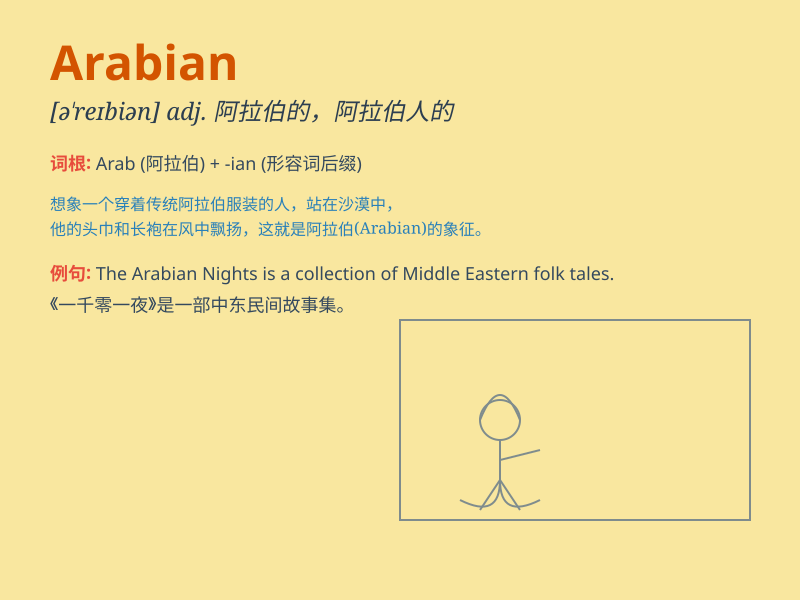

## Arabian

**英音:** _[əˈreɪbiən]_ **美音:** _[əˈreɪbiən]_

**译义:** *adj.阿拉伯的；阿拉伯人的 n.阿拉伯人*

### 短语

+ **Arabian Nights:** _《一千零一夜》（书名）_

+ **Arabian Peninsula:** _阿拉伯半岛_

+ **Arabian Sea:** _阿拉伯海_

+ **Arabian camel:** _阿拉伯骆驼_

+ **Arabian coffee:** _阿拉伯咖啡_

### 例句

#### 例句1

> **The Arabian Nights is a famous collection of stories.**

**中文翻译:** 《一千零一夜》是著名的故事集。

**单词释义:** 阿拉伯的

#### 例句2

> **The Arabian horse is known for its beauty and speed.**

**中文翻译:** 阿拉伯马以其美丽和速度而闻名。

**单词释义:** 阿拉伯的

#### 例句3

> **She wore an Arabian style dress to the party.**

**中文翻译:** 她穿着一件阿拉伯风格的裙子去参加聚会。

**单词释义:** 阿拉伯的

### 背诵小故事

> Once upon a time, there was a traveler who met an Arabian in the
desert. The Arabian had a beautiful horse and wore colorful clothes. The
traveler was amazed by the Arabian\'s charm and friendliness.

**从前，有一位旅行者在沙漠中遇到了一位阿拉伯人。这位阿拉伯人有一匹漂亮的马，穿着色彩鲜艳的衣服。旅行者对这位阿拉伯人的魅力和友好感到惊讶。**

### 图义

