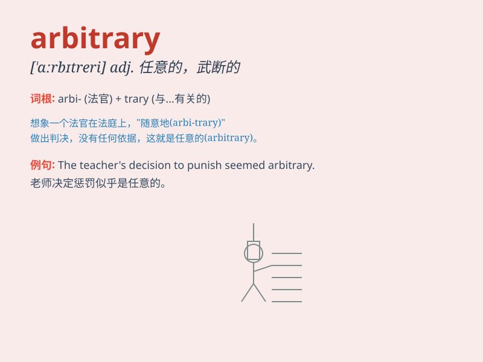

## arbitrary

**英音:** _[\'ɑːbɪt(rə)rɪ]_ **美音:** _[ˈɑːrbətreri]_

**译义:** *adj.任意的,武断的,独裁的,专断的*

### 短语

+ **arbitrary decision:** _任意的决定_

+ **arbitrary choice:** _随意的选择_

+ **arbitrary power:** _专制权力_

+ **arbitrary rule:** _专断的规则_

+ **arbitrary action:** _武断的行动_

### 例句

#### 例句1

> **The teacher\'s decision seemed arbitrary and unfair.**

**中文翻译:** 老师的决定看起来随意且不公平。

**单词释义:** 随意的；任性的；随心所欲的

#### 例句2

> **The rules were changed in an arbitrary manner.**

**中文翻译:** 规则以一种随意的方式被改变了。

**单词释义:** 任意的；武断的

#### 例句3

> **His choice of colors was quite arbitrary.**

**中文翻译:** 他对颜色的选择相当随意。

**单词释义:** 随机的；无理由的

### 背诵小故事

> Once upon a time, a king made arbitrary decisions. He didn\'t follow
any rules and just did what he wanted. People were unhappy because his
choices were so unfair and unpredictable.

**从前，有一位国王做出任意的决定。他不遵循任何规则，只凭自己的意愿行事。人们很不高兴，因为他的选择如此不公平和难以预测。**

### 图义

