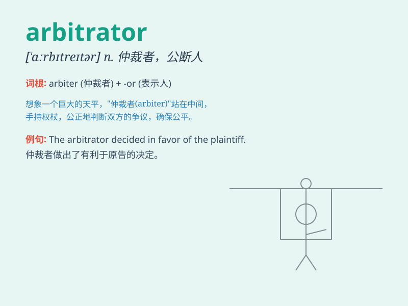

## arbitrator

**英音:** _[\'ɑːbɪtreɪtə]_ **美音:** _[\'ɑrbə\'tretɚ]_

**译义:** *n.仲裁人,公断者*

### 短语

+ **impartial arbitrator:** _公正的仲裁人_

+ **professional arbitrator:** _专业仲裁员_

+ **designated arbitrator:** _指定的仲裁人_

+ **experienced arbitrator:** _经验丰富的仲裁员_

+ **neutral arbitrator:** _中立的仲裁人_

### 例句

#### 例句1

> **The arbitrator was chosen to resolve the labor dispute.**

**中文翻译:** 仲裁员被选出来解决劳动纠纷。

**单词释义:** 仲裁员

#### 例句2

> **The company turned to an independent arbitrator to settle the
contract disagreement.**

**中文翻译:** 公司求助于一位独立的仲裁员来解决合同分歧。

**单词释义:** 仲裁员

#### 例句3

> **The arbitrator\'s decision was final and binding.**

**中文翻译:** 仲裁员的决定是最终且有约束力的。

**单词释义:** 仲裁员

### 背诵小故事

> One day, in a heated dispute between two companies, an arbitrator was
called in. The arbitrator, like a wise judge, listened carefully to both
sides and made a fair decision, ending the conflict.

**有一天，在两家公司的激烈争端中，一位仲裁员被请来。这位仲裁员就像一位明智的法官，仔细倾听双方的意见，并做出了公平的决定，结束了这场冲突。**

### 图义

