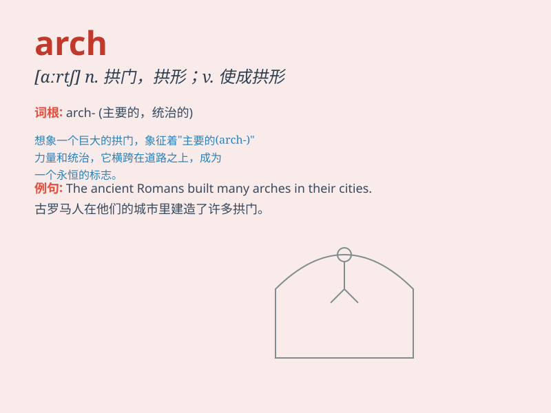

## arch

**英音:** _[ɑːtʃ]_ **美音:** _[ɑrtʃ]_

**译义:** *n.拱门,弓形结构,拱形v.(使)弯成弓形adj.主要*

### 短语

+ **arch enemy:** _死敌；主要敌人_

+ **arch bridge:** _拱桥_

+ **arch support:** _足弓支撑；拱座_

+ **arch over:** _成拱形覆盖_

+ **arch of triumph:** _凯旋门_

### 例句

#### 例句1

> **The arch of the bridge is very beautiful.**

**中文翻译:** 桥的拱门非常漂亮。

**单词释义:** 拱形结构

#### 例句2

> **She is the arch villain of the movie.**

**中文翻译:** 她是这部电影的大反派。

**单词释义:** 首要的；主要的

#### 例句3

> **The arch of his foot is high.**

**中文翻译:** 他的足弓很高。

**单词释义:** 足弓

### 背诵小故事

>
想象一下，在古老的城堡前，有一座弯弯的拱门（arch）。一位勇敢的骑士骑着马从下面穿过。这拱门就像一个大大的微笑，欢迎着每一个人的到来。

**想象在古老城堡前有一座弯弯的拱门，一位骑士骑马穿过，拱门像大大的微笑欢迎人到来。**

### 图义

