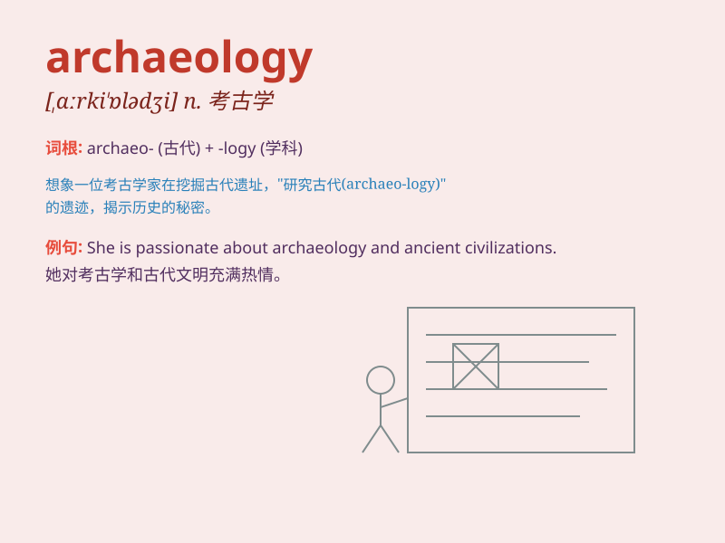

## archaeology

**英音:** _[,ɑːkɪ\'ɒlədʒɪ]_ **美音:** _[,ɑrkɪ\'ɑlədʒi]_

**译义:** *n.考古学*

### 短语

+ **Archaeology Museum:** _考古博物馆_

+ **Marine Archaeology:** _海洋考古学_

+ **Experimental Archaeology:** _实验考古学_

+ **Archaeology Fieldwork:** _考古实地考察_

+ **Urban Archaeology:** _城市考古_

### 例句

#### 例句1

> **Archaeology is a fascinating field that uncovers the mysteries of
the past.**

**中文翻译:** 考古学是一个令人着迷的领域，它揭示了过去的奥秘。

**单词释义:** 考古学

#### 例句2

> **She decided to study archaeology at university because of her
passion for ancient civilizations.**

**中文翻译:** 由于对古代文明的热情，她决定在大学学习考古学。

**单词释义:** 考古学

#### 例句3

> **The recent discovery in archaeology has rewritten the history of
the region.**

**中文翻译:** 最近的考古发现改写了该地区的历史。

**单词释义:** 考古学

### 背诵小故事

> A brave adventurer was always passionate about uncovering ancient
secrets. One day, he embarked on a journey to explore old ruins, and
this pursuit led him to the field of archaeology. He dug, discovered,
and unlocked the mysteries of the past.

**一位勇敢的冒险家一直热衷于揭开古老的秘密。有一天，他踏上了探索古老遗迹的旅程，这一追求将他带入了考古学领域。他挖掘、发现并解开了过去的谜团。**

### 图义

