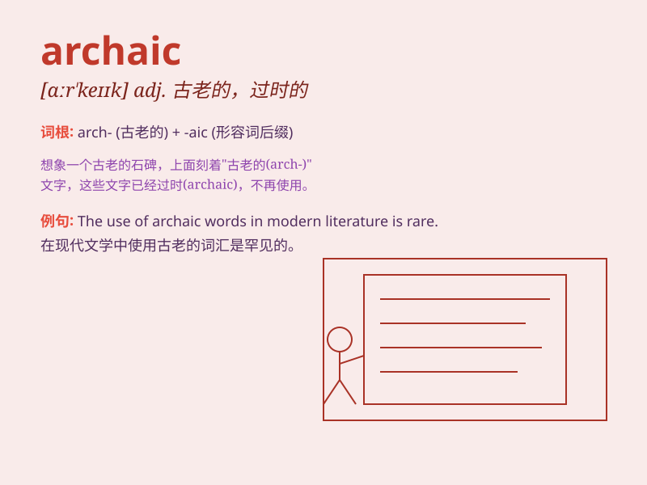

## archaic

**英音:** _[ɑː\'keɪɪk]_ **美音:** _[ɑr\'keɪk]_

**译义:** *adj.古老的,古代的,陈旧的*

### 短语

+ **archaic language:** _古旧语言_

+ **archaic custom:** _古老的习俗_

+ **archaic style:** _古风_

+ **archaic law:** _古老的法律_

+ **archaic form:** _古旧的形式_

### 例句

#### 例句1

> **The archaic laws were no longer relevant in modern society.**

**中文翻译:** 古老的法律在现代社会中不再适用。

**单词释义:** 古老的；过时的

#### 例句2

> **The building had an archaic architectural style.**

**中文翻译:** 该建筑具有古式建筑风格。

**单词释义:** 古老的；古代的

#### 例句3

> **His language was archaic and difficult to understand.**

**中文翻译:** 他的语言很古老而且难以理解。

**单词释义:** 陈旧的；过时的

### 背诵小故事

> Long ago, a traveler found an archaic map in an old castle. It was so
old and strange that no one could understand it easily. The map led to
hidden treasures from a bygone era. \'Archaic\' means old and outdated.

**很久以前，一位旅行者在一座古老的城堡里发现了一张古老的地图。它太古老和奇怪了，以至于没人能轻易理解。这张地图指向了过去时代隐藏的宝藏。\'archaic\'意思是古老的、过时的。**

### 图义

