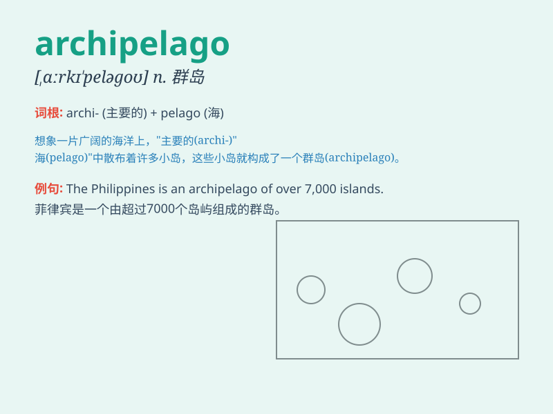

## archipelago

**英音:** _[,ɑːkɪ\'peləgəʊ]_ **美音:**
_[\'ɑrkə\'pɛlə\'go]_

**译义:** *n.群岛,多岛海*

### 短语

+ **archipelago nation:** _群岛国家_

+ **volcanic archipelago:** _火山群岛_

+ **tropical archipelago:** _热带群岛_

+ **magnificent archipelago:** _壮丽的群岛_

+ **isolated archipelago:** _孤立的群岛_

### 例句

#### 例句1

> **The Philippines is an archipelago composed of over 7,000
islands.**

**中文翻译:** 菲律宾是一个由 7000 多个岛屿组成的群岛。

**单词释义:** 群岛

#### 例句2

> **The sailors were lost in the vast archipelago.**

**中文翻译:** 水手们在广阔的群岛中迷路了。

**单词释义:** 群岛

#### 例句3

> **The archipelago is home to a rich variety of wildlife.**

**中文翻译:** 这个群岛是丰富多样的野生动物的家园。

**单词释义:** 群岛

### 背诵小故事

> A brave sailor was lost in the vast sea. He struggled to find his way
among many islands. Finally, he realized he was in an \'archipelago\' -
a group of many islands.

**一位勇敢的水手在辽阔的大海中迷失了方向。他努力在众多岛屿间寻找出路。最后，他意识到自己身处一个'群岛'------众多岛屿组成的区域。**

### 图义

