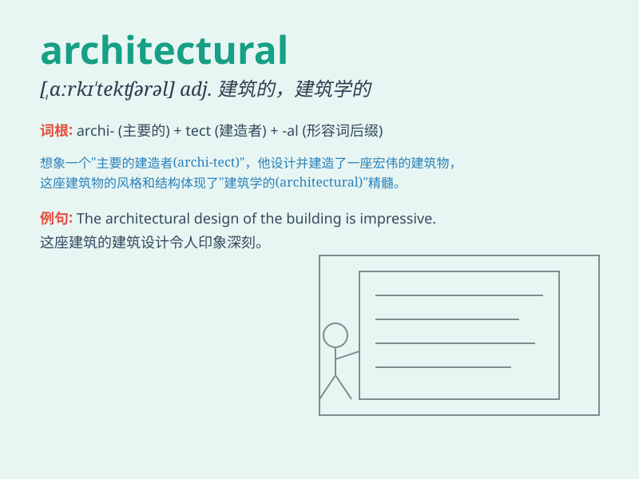

## architectural

**英音:** _[,ɑːkɪ\'tektʃərəl]_ **美音:**
_[,ɑrkɪ\'tɛktʃərəl]_

**译义:** *adj.建筑上的,建筑学的*

### 短语

+ **architectural design:** _建筑设计_

+ **architectural style:** _建筑风格_

+ **architectural masterpiece:** _建筑杰作_

+ **architectural feature:** _建筑特色_

+ **architectural firm:** _建筑公司_

### 例句

#### 例句1

> **The architectural design of this building is very unique.**

**中文翻译:** 这座建筑的建筑设计非常独特。

**单词释义:** 建筑的

#### 例句2

> **She has a deep interest in architectural history.**

**中文翻译:** 她对建筑历史有着浓厚的兴趣。

**单词释义:** 建筑的

#### 例句3

> **The city is famous for its architectural masterpieces.**

**中文翻译:** 这座城市因其建筑杰作而闻名。

**单词释义:** 建筑的

### 背诵小故事

> A young architect was designing a unique building. He spent days
thinking about the architectural details, like the shape of the roof and
the placement of windows. Finally, his masterpiece was born, showing his
amazing architectural skills.

**一位年轻的建筑师正在设计一座独特的建筑。他花了好几天思考建筑细节，比如屋顶的形状和窗户的位置。最后，他的杰作诞生了，展现出他惊人的建筑技艺。**

### 图义

