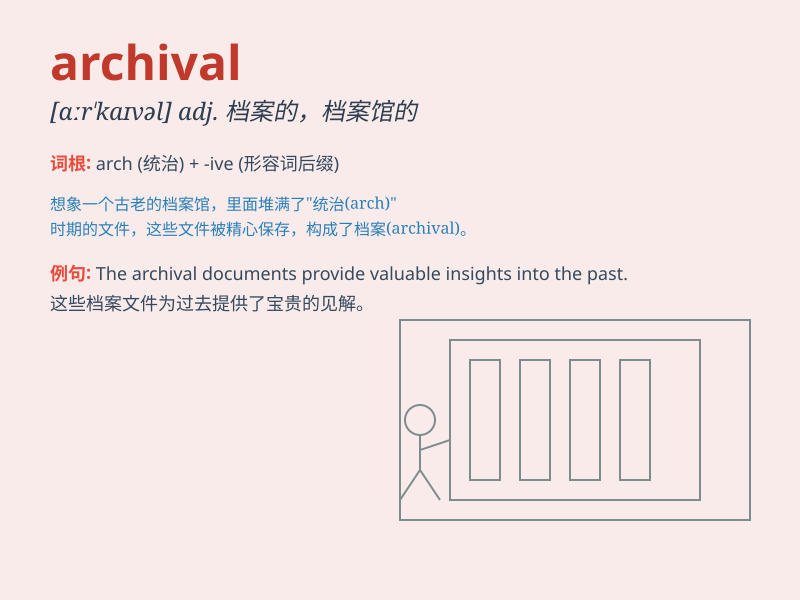

## archival

**英音:** _[ɑː\'kaɪvəl]_ **美音:** _[ɑr\'kaɪvl]_

**译义:** *adj.关于档案的*

### 短语

+ **archival material:** _档案材料_

+ **archival research:** _档案研究_

+ **archival record:** _档案记录_

+ **archival storage:** _档案存储_

+ **archival quality:** _档案质量_

### 例句

#### 例句1

> **The museum has an extensive archival collection of ancient
artifacts.**

**中文翻译:** 这个博物馆有大量的古代文物档案收藏。

**单词释义:** 档案的；档案中的

#### 例句2

> **Archival research is crucial for understanding historical
events.**

**中文翻译:** 档案研究对于理解历史事件至关重要。

**单词释义:** 档案的；与档案有关的

#### 例句3

> **The library provides access to archival materials for
scholars.**

**中文翻译:** 图书馆为学者提供档案材料的使用权限。

**单词释义:** 档案的；档案方面的

### 背诵小故事

> A detective was looking for archival records to solve a mystery. He
searched through old files and documents, finally finding the key clue
in the archival room. Archival means related to archives or records kept
for future reference.

**一位侦探正在寻找档案记录来解开一个谜团。他在旧文件和文档中搜寻，最终在档案室里找到了关键线索。Archival
意思是与档案或为将来参考保存的记录有关。**

### 图义

