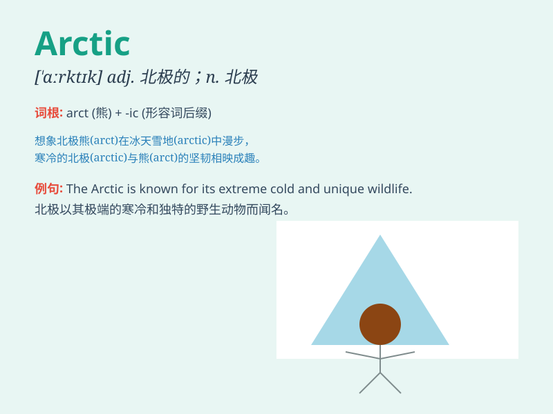

## Arctic

**英音:** _[ˈɑːrktɪk]_ **美音:** _[ˈɑːrktɪk]_

**译义:** *adj.北极的; 北极区的; n.北极; 北极圈*

### 短语

+ **Arctic Circle:** _北极圈_

+ **Arctic Ocean:** _北冰洋_

+ **Arctic climate:** _北极气候_

+ **Arctic explorer:** _北极探险家_

+ **Arctic region:** _北极地区_

### 例句

#### 例句1

> **The Arctic is very cold and inhospitable.**

**中文翻译:** 北极非常寒冷且不宜居住。

**单词释义:** 北极

#### 例句2

> **Arctic animals have special adaptations to survive the extreme
cold.**

**中文翻译:** 北极动物有特殊的适应能力来在极度寒冷中生存。

**单词释义:** 北极的

#### 例句3

> **The explorers braved the Arctic conditions to reach their
destination.**

**中文翻译:** 探险家们勇敢地面对北极的环境以到达目的地。

**单词释义:** 北极的

### 背诵小故事

> A brave explorer set off for the Arctic. The cold was intense, but he
saw beautiful auroras. He struggled but finally reached his destination.
Remember, Arctic is the coldest place on Earth.

**一位勇敢的探险家出发前往北极。那里寒冷至极，但他看到了美丽的极光。他历经艰难，最终到达了目的地。记住，Arctic
就是地球最寒冷的地方。**

### 图义

