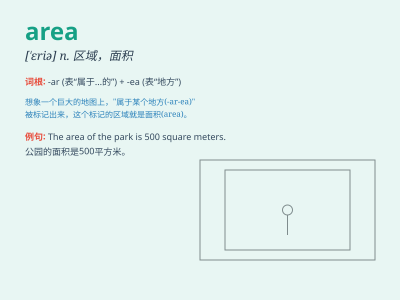

## area

**英音:** _[\'eərɪə]_ **美音:** _[ˈeriə]_

**译义:** *n.范围,区域,面积,地区,空地*

### 短语

+ **urban area:** _市区；城市地区_

+ **rural area:** _农村地区；乡村地区_

+ **mountainous area:** _山区_

+ **coastal area:** _沿海地区_

+ **residential area:** _住宅区_

### 例句

#### 例句1

> **The area of this park is quite large.**

**中文翻译:** 这个公园的面积相当大。

**单词释义:** 面积

#### 例句2

> **The mountainous area is difficult to access.**

**中文翻译:** 山区难以进入。

**单词释义:** 地区；区域

#### 例句3

> **She is an expert in the area of medicine.**

**中文翻译:** 她是医学领域的专家。

**单词释义:** 领域；方面

### 背诵小故事

> A rabbit was lost in a strange place. It kept running and found a
beautiful area with green grass and colorful flowers. The rabbit was
happy as it finally found a nice area to play.

**一只兔子在一个陌生的地方迷路了。它一直跑，发现了一个美丽的区域，有绿草和五颜六色的花。兔子很高兴，因为它终于找到了一个玩耍的好地方。**

### 图义

