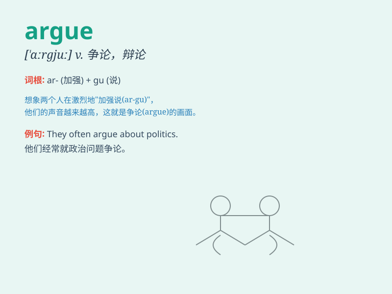

## argue

**英音:** _[\'ɑːgjuː]_ **美音:** _[\'ɑrgjʊ]_

**译义:** *vi.争论,辩论vt.说服*

### 短语

+ **argue with:** _与\...\...争论，和\...\...争吵_

+ **argue about:** _争论，辩论关于\...\..._

+ **argue over:** _为\...\...而争论_

+ **argue against:** _反对，据理反对_

+ **argue for:** _为\...\...辩护，赞成_

### 例句

#### 例句1

> **They always argue about politics.**

**中文翻译:** 他们总是争论政治。

**单词释义:** 争论；争吵

#### 例句2

> **She tried to argue him out of leaving.**

**中文翻译:** 她试图劝说他不要离开。

**单词释义:** 说服；劝说

#### 例句3

> **The lawyer will argue the case in court.**

**中文翻译:** 律师将在法庭上对此案进行辩论。

**单词释义:** 辩论；辩护

### 背诵小故事

> One day, Tom and Jerry argued fiercely about which cartoon was
better. Tom insisted his favorite was great, while Jerry argued for his
own choice. They shouted and their faces turned red. Finally, they
realized arguing was pointless and made up.

**有一天，汤姆和杰瑞激烈地争论哪个卡通片更好。汤姆坚持说他最喜欢的很棒，而杰瑞则为自己的选择争辩。他们大喊大叫，脸都变红了。最后，他们意识到争论毫无意义，就和好了。**

### 图义

