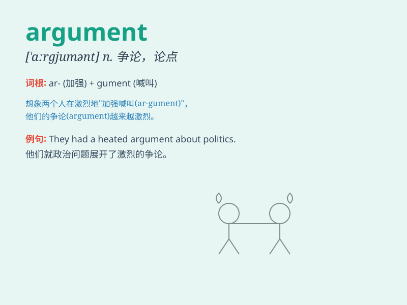

## argument

**英音:** _[\'ɑːgjʊm(ə)nt]_ **美音:** _[\'ɑrɡjumənt]_

**译义:** *n.争论,辩论,论据,论点,～ (for,against),意见*

### 短语

+ **have an argument:** _进行争论_

+ **settle an argument:** _解决争论_

+ **win/lose an argument:** _在争论中获胜/失败_

+ **put forward an argument:** _提出论点_

+ **strong/weak argument:** _有力/无力的论点_

### 例句

#### 例句1

> **They had a heated argument about the best way to solve the
problem.**

**中文翻译:** 他们就解决问题的最佳方法进行了激烈的争论。

**单词释义:** 争论；争吵

#### 例句2

> **The lawyer presented a strong argument in court.**

**中文翻译:** 律师在法庭上提出了强有力的论据。

**单词释义:** 论点；论据

#### 例句3

> **I don\'t see the argument for changing the system.**

**中文翻译:** 我没有看到改变系统的理由。

**单词释义:** 理由；论证

### 背诵小故事

> One day, Tom and Jerry had an argument over a piece of cheese. Tom
insisted it was his, while Jerry claimed it was hers. Their voices got
louder and louder. Finally, they decided to share it to end the
argument.

**有一天，汤姆和杰瑞因为一块奶酪发生了争论。汤姆坚持认为是他的，而杰瑞声称是她的。他们的声音越来越大。最后，他们决定分享奶酪来结束这场争论。**

### 图义

