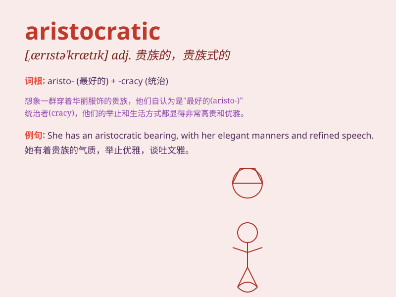

## aristocratic

**英音:** _[,ærɪstə\'krætɪk]_ **美音:**
_[ə,rɪstə\'krætɪk]_

**译义:** *adj.贵族的,贵族化的,贵族政治的*

### 短语

+ **aristocratic family:** _贵族家庭_

+ **aristocratic background:** _贵族背景_

+ **aristocratic manner:** _贵族风度_

+ **aristocratic privilege:** _贵族特权_

+ **aristocratic title:** _贵族头衔_

### 例句

#### 例句1

> **She has an aristocratic bearing and demeanor.**

**中文翻译:** 她有一种贵族的气度和风度。

**单词释义:** 贵族的；贵族气派的

#### 例句2

> **The aristocratic family owned a large estate.**

**中文翻译:** 这个贵族家庭拥有一大笔庄园。

**单词释义:** 贵族的

#### 例句3

> **His tastes are rather aristocratic, preferring fine art and
classical music.**

**中文翻译:** 他的品味相当贵族化，更喜欢美术和古典音乐。

**单词释义:** 贵族式的；有贵族气质的

### 背诵小故事

> A rich man named Alex always wore elegant clothes and lived in a huge
mansion. Everyone said he had an aristocratic lifestyle. One day, a poor
boy asked him what made him so special. Alex replied, \'It\'s my noble
birth and refined taste.\'

**一个名叫亚历克斯的富人总是穿着优雅的衣服，住在一座大豪宅里。大家都说他有着贵族般的生活方式。有一天，一个穷孩子问他是什么让他如此特别。亚历克斯回答说：'这是因为我高贵的出身和高雅的品味。'**

### 图义

