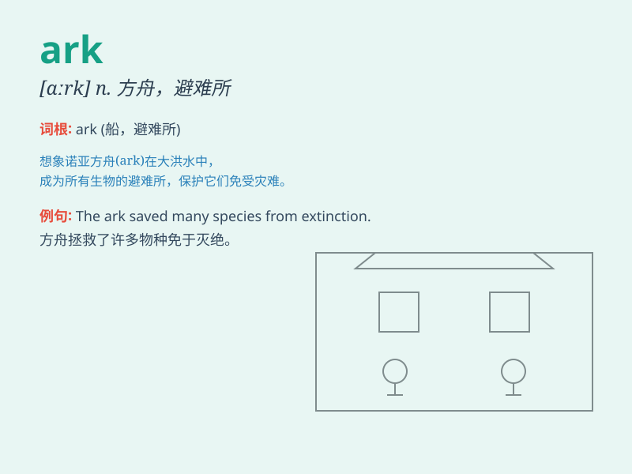

## ark

**英音:** _[ɑːk]_ **美音:** _[ɑrk]_

**译义:** *n.方舟,约柜,箱子 (Ark)n. \<圣经>方舟*

### 短语

+ **Noah\'s Ark:** _诺亚方舟_

+ **ark of the covenant:** _约柜_

+ **ark shell:** _舟贝_

+ **ark of refuge:** _避难所_

+ **ark of safety:** _安全的港湾_

### 例句

#### 例句1

> **The animals were taken into the ark before the flood.**

**中文翻译:** 洪水之前，动物被带进方舟。

**单词释义:** 方舟

#### 例句2

> **The museum is like an ark of history.**

**中文翻译:** 博物馆就像一艘历史的方舟。

**单词释义:** 象征保护或避难所的地方

#### 例句3

> **She keeps her precious memories in the ark of her heart.**

**中文翻译:** 她把珍贵的记忆珍藏在心底的方舟里。

**单词释义:** 内心深处的庇护所

### 背诵小故事

> In a world threatened by a great flood, a brave man built an ark to
save all kinds of animals. It was a huge vessel that gave hope and
protection. Remember, ark means a large boat or ship.

**在一个被大洪水威胁的世界里，一位勇敢的人建造了一艘方舟来拯救各种各样的动物。这是一艘巨大的船，给予了希望和保护。记住，ark
意思是大船或方舟。**

### 图义

