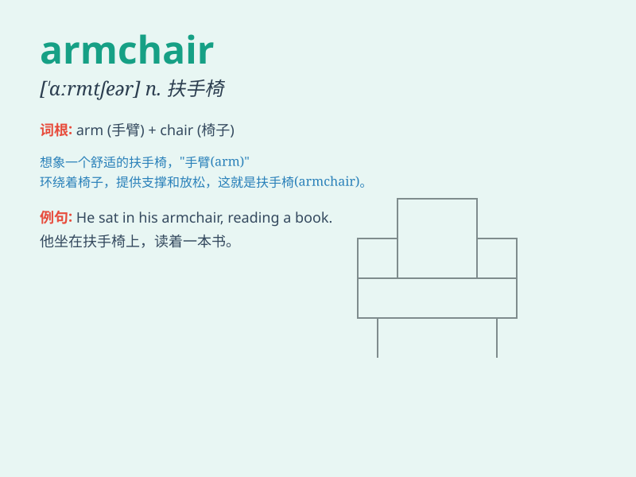

## armchair

**英音:** _[ɑːm\'tʃeə; \'ɑːm-]_ **美音:** _[\'ɑrmtʃɛr]_

**译义:** *n.扶手椅子*

### 短语

+ **armchair critic:** _空谈的批评家；不切实际的批评者_

+ **armchair traveller:** _神游旅行者；足不出户的幻想旅行家_

+ **armchair detective:** _安乐椅侦探；不实地推理案情的人_

+ **armchair quarterback:** _纸上谈兵的人；光说不练的指挥者_

+ **armchair general:** _纸上谈兵的将军；不实际指挥作战的人_

### 例句

#### 例句1

> **He sat in the armchair and read a book.**

**中文翻译:** 他坐在扶手椅上看书。

**单词释义:** 扶手椅

#### 例句2

> **The old man dozed off in the armchair.**

**中文翻译:** 老人在扶手椅上打瞌睡。

**单词释义:** 扶手椅

#### 例句3

> **She placed a cushion on the armchair for comfort.**

**中文翻译:** 为了舒服，她在扶手椅上放了一个垫子。

**单词释义:** 扶手椅

### 背诵小故事

> One day, a tired man came home and sat in an \'armchair\'. He put his
arms on the sides and felt so relaxed. The chair was like a cozy hug for
his arms, making him forget all the stress.

**一天，一个疲惫的男人回到家坐在一张扶手椅上。他把胳膊放在两边，感觉非常放松。这把椅子就像给胳膊的一个舒适的拥抱，让他忘却了所有的压力。**

### 图义

