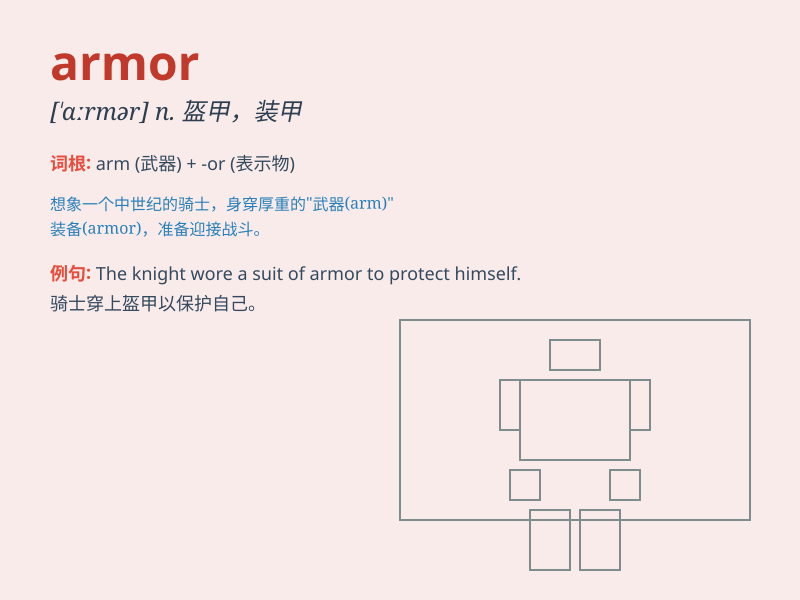

## armor

**英音:** _[ˈɑːmə]_ **美音:** _[ˈɑrmər]_

**译义:** *n.装甲*

### 短语

+ **body armor:** _防弹衣；护身铠甲_

+ **armor plate:** _装甲板_

+ **armor piercing:** _穿甲的_

+ **heavy armor:** _重甲；重型装甲_

+ **knight\'s armor:** _骑士的盔甲_

### 例句

#### 例句1

> **The knight wore heavy armor into battle.**

**中文翻译:** 骑士穿着重甲参加战斗。

**单词释义:** 盔甲

#### 例句2

> **The tank\'s armor protected the crew from enemy fire.**

**中文翻译:** 坦克的装甲保护乘员免受敌人火力的伤害。

**单词释义:** 装甲

#### 例句3

> **She felt safe behind the emotional armor she had built.**

**中文翻译:** 在她建立的情感盔甲后面，她感到很安全。

**单词释义:** 保护物；防御物

### 背诵小故事

> A brave knight wore shiny ARMOR to protect himself in the battle. The
ARMOR was so strong that it deflected all the enemy\'s attacks. With it,
the knight felt safe and confident to fight for justice.

**一位勇敢的骑士在战斗中穿着闪亮的盔甲来保护自己。这副盔甲非常坚固，能挡下敌人所有的攻击。有了它，骑士感到安全且有信心为正义而战。**

### 图义

