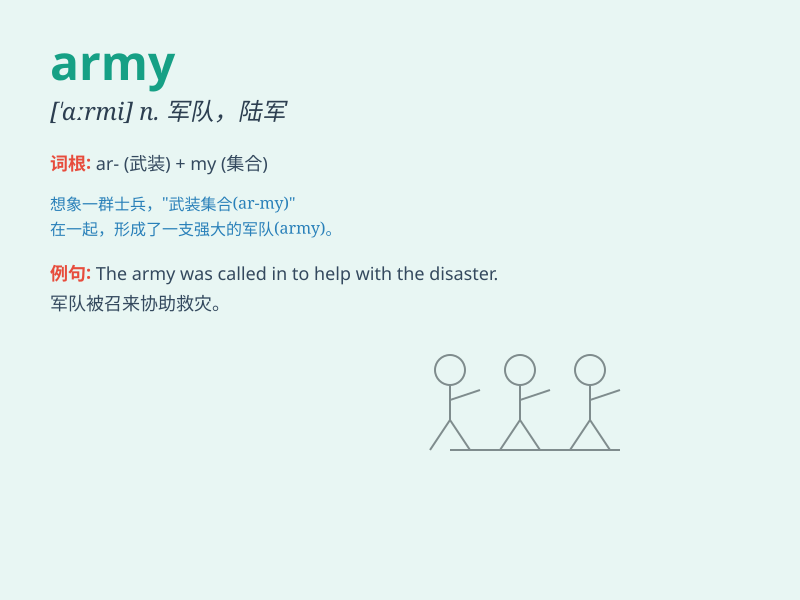

## army

**英音:** _[\'ɑːmɪ]_ **美音:** _[\'ɑrmi]_

**译义:** *n.陆军,军队,大群,大军*

### 短语

+ **join the army:** _参军_

+ **army base:** _军事基地_

+ **standing army:** _常备军_

+ **army officer:** _军官_

+ **volunteer army:** _志愿军_

### 例句

#### 例句1

> **The army was called in to restore order.**

**中文翻译:** 军队被召集来恢复秩序。

**单词释义:** 军队

#### 例句2

> **He joined the army after graduating from high school.**

**中文翻译:** 高中毕业后他参军了。

**单词释义:** 军队

#### 例句3

> **The army has advanced several miles.**

**中文翻译:** 大军已前进数里。

**单词释义:** 军队

### 背诵小故事

> A brave boy named Tom always dreamed of joining the army. One day, he
saw soldiers marching in perfect order. He was deeply impressed and
decided to train hard to become one of them. Finally, he achieved his
dream and wore the proud uniform of the army.

**一个叫汤姆的勇敢男孩一直梦想着参军。有一天，他看到士兵们整齐地行进。他深受触动，决定刻苦训练成为其中一员。最终，他实现了梦想，穿上了军队那自豪的制服。**

### 图义

