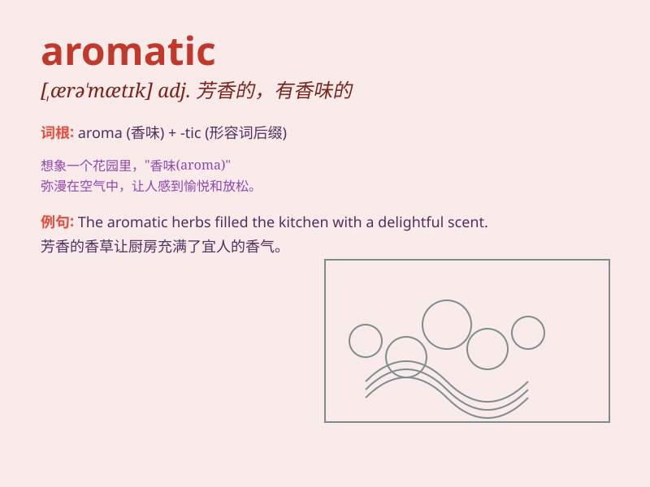

## aromatic

**英音:** _[ærə\'mætɪk]_ **美音:** _[,ærə\'mætɪk]_

**译义:** *adj.芬芳的*

### 短语

+ **aromatic herb:** _芳香的草本植物_

+ **aromatic compound:** _芳香族化合物_

+ **aromatic essence:** _芳香精华_

+ **aromatic oil:** _芳香油_

+ **aromatic smoke:** _芳香的烟雾_

### 例句

#### 例句1

> **The garden was filled with aromatic flowers.**

**中文翻译:** 花园里开满了芳香的花朵。

**单词释义:** 芳香的

#### 例句2

> **This aromatic wine has a rich flavor.**

**中文翻译:** 这种酒芳香浓郁，味道浓郁。

**单词释义:** 芳香的

#### 例句3

> **The air was redolent with the aromatic smell of spices.**

**中文翻译:** 空气中弥漫着香料的芳香。

**单词释义:** 芳香的

### 背诵小故事

>
在一个神秘的花园里，有一朵特别的花，它散发着迷人的香气。人们一靠近就被这股芬芳吸引，纷纷称赞它是
\'aromatic\' 的。原来这就是芳香的魅力。

**在一个神秘花园里，有一朵散发迷人香气的花，人们称赞它是芳香的，这就是'aromatic'这个单词所代表的意思。**

### 图义

