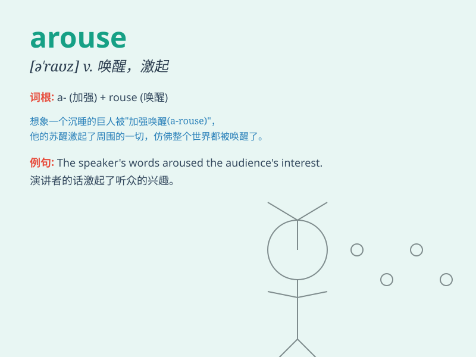

## arouse

**英音:** _[ə\'raʊz]_ **美音:** _[ə\'raʊz]_

**译义:** *vt.唤醒,唤起,鼓励,引起vi.睡醒*

### 短语

+ **arouse interest:** _引起兴趣_

+ **arouse suspicion:** _引起怀疑_

+ **arouse curiosity:** _激起好奇心_

+ **arouse anger:** _激起愤怒_

+ **arouse emotions:** _唤起情感_

### 例句

#### 例句1

> **The speech aroused the enthusiasm of the audience.**

**中文翻译:** 演讲引起了听众的热情。

**单词释义:** 激起；引起

#### 例句2

> **The smell of coffee aroused my hunger.**

**中文翻译:** 咖啡的香味引起了我的饥饿感。

**单词释义:** 引起；唤起

#### 例句3

> **His behavior aroused suspicion.**

**中文翻译:** 他的行为引起了怀疑。

**单词释义:** 引起；引发

### 背诵小故事

> A prince was sleeping in a peaceful forest. Suddenly, a loud noise
aroused him. It was a group of wild animals running around. The prince
was fully awake and ready to face the unexpected situation.

**一位王子正在宁静的森林里睡觉。突然，一阵巨大的声响唤醒了他。原来是一群野生动物在四处奔跑。王子完全清醒，准备应对这意想不到的状况。**

### 图义

