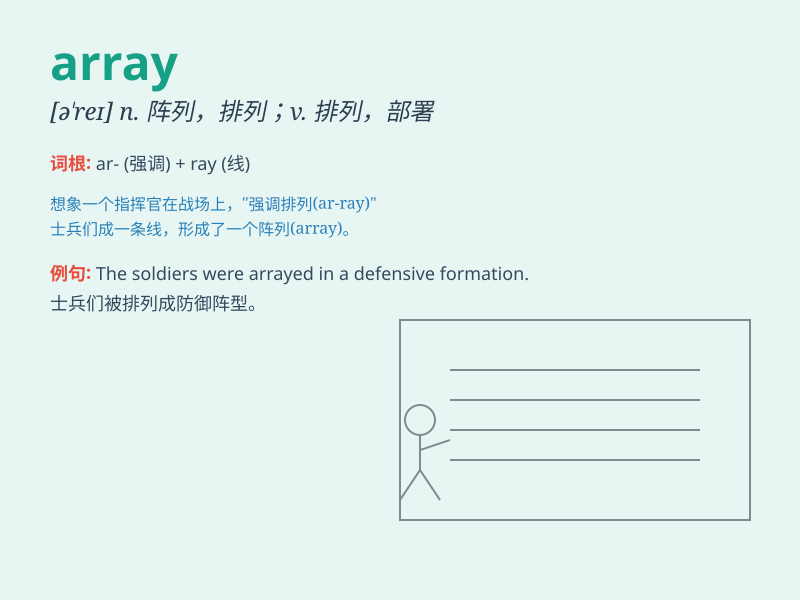

## array

**英音:** _[ə\'reɪ]_ **美音:** _[ə\'re]_

**译义:** *n.排列,编队,军队,衣服,大批;vt.部署,穿着,排列*

### 短语

+ **an array of:** _一系列；一排；一批_

+ **in array:** _排列整齐；整装_

+ **array oneself:** _打扮；装饰_

+ **linear array:** _线性阵列；线性数组_

+ **phased array:** _相控阵；相位阵列_

### 例句

#### 例句1

> **The store has a vast array of products for customers to choose
from.**

**中文翻译:** 店内商品种类丰富，可供顾客挑选。

**单词释义:** 各种各样；大量

#### 例句2

> **The soldiers were in battle array.**

**中文翻译:** 士兵们已列好阵。

**单词释义:** 队列；阵势

#### 例句3

> **She arrayed herself in her finest dress.**

**中文翻译:** 她穿上了最漂亮的衣服。

**单词释义:** 装扮；排列

### 背诵小故事

>
想象一个国王，他面前有一个巨大的陈列台(array)，上面整齐摆放着各种珍贵的宝物，有闪闪发光的宝石，精致的皇冠和华丽的佩剑。这个陈列台就像
array 一样，是有序的排列组合。

**想象国王面前摆放着宝物的陈列台来辅助记忆 array
这个表示排列、阵列的单词**

### 图义

