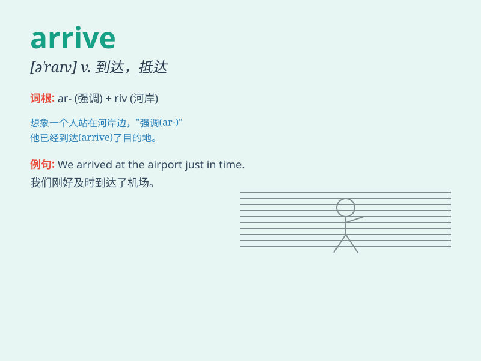

## arrive

**英音:** _[ə\'raɪv]_ **美音:** _[ə\'raɪv]_

**译义:** *vi.到达,抵达*

### 短语

+ **arrive at:** _到达（小地点）_

+ **arrive in:** _到达（大地点）_

+ **arrive late:** _迟到_

+ **arrive early:** _早到_

+ **arrive safely:** _安全到达_

### 例句

#### 例句1

> **I usually arrive at school before 8 o\'clock.**

**中文翻译:** 我通常在八点之前到达学校。

**单词释义:** 到达

#### 例句2

> **The train arrived late due to bad weather.**

**中文翻译:** 由于天气不好，火车晚点了。

**单词释义:** 到达

#### 例句3

> **When will they arrive in Beijing?**

**中文翻译:** 他们什么时候到达北京？

**单词释义:** 到达

### 背诵小故事

> A brave adventurer was on a long journey. He faced many difficulties
but never gave up. Finally, he reached his destination and arrive d. It
was a moment of great joy and relief.

**一位勇敢的冒险家正在长途旅行。他面临诸多困难但从未放弃。最终，他到达了目的地并抵达了。这是充满喜悦和放松的一刻。**

### 图义

