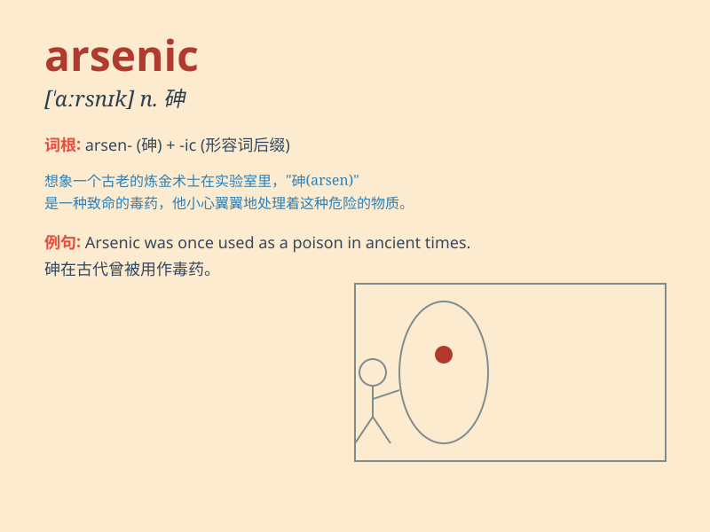

## arsenic

**英音:** _[\'ɑːs(ə)nɪk]_ **美音:** _[\'ɑrsnɪk]_

**译义:** *n.[化]砷,砒霜*

### 短语

+ **arsenic poisoning:** _砷中毒_

+ **arsenic trioxide:** _三氧化二砷_

+ **white arsenic:** _砒霜；白砷_

+ **arsenic contamination:** _砷污染_

+ **arsenic content:** _砷含量_

### 例句

#### 例句1

> **Arsenic is a highly toxic substance.**

**中文翻译:** 砷是一种剧毒物质。

**单词释义:** 砷（一种化学元素）

#### 例句2

> **The presence of arsenic in the water supply was detected.**

**中文翻译:** 检测到供水中存在砷。

**单词释义:** 砷

#### 例句3

> **Excessive exposure to arsenic can cause serious health
problems.**

**中文翻译:** 过量接触砷会导致严重的健康问题。

**单词释义:** 砷

### 背诵小故事

> In a mysterious laboratory, a scientist was handling a dangerous
substance. He wore special gear as he dealt with the arsenic. One wrong
move and it could be fatal. Remember, arsenic is that scary and deadly
stuff!

**在一个神秘的实验室里，一位科学家正在处理一种危险物质。他穿着特殊装备处理砷。一个错误的举动就可能是致命的。记住，砷就是那种可怕又致命的东西！**

### 图义

