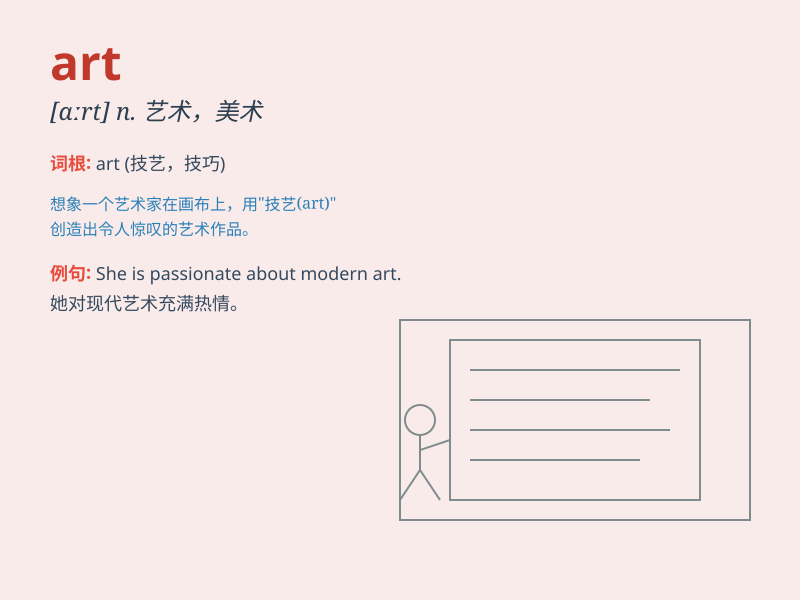

## art

**英音:** _[ɑːt]_ **美音:** _[ɑrt]_

**译义:** *n.艺术,艺术品,技术,巧妙,美术*

### 短语

+ **art gallery:** _美术馆；艺术画廊_

+ **modern art:** _现代艺术_

+ **performance art:** _行为艺术；表演艺术_

+ **art class:** _美术课_

+ **art exhibition:** _艺术展览_

### 例句

#### 例句1

> **She has a great passion for art.**

**中文翻译:** 她对艺术有着极大的热情。

**单词释义:** 艺术

#### 例句2

> **Modern art is very different from traditional art.**

**中文翻译:** 现代艺术与传统艺术有很大不同。

**单词释义:** 艺术

#### 例句3

> **The art of cooking requires practice and patience.**

**中文翻译:** 烹饪艺术需要练习和耐心。

**单词释义:** 技艺；技巧

### 背诵小故事

> A little mouse dreams of becoming an art master. One day, it finds
colors and brushes and starts creating. It paints beautiful pictures and
shows them to everyone. The mouse discovers the magic of art.

**一只小老鼠梦想成为艺术大师。有一天，它找到颜料和画笔并开始创作。它画了美丽的画并展示给大家。小老鼠发现了艺术的魔力。**

### 图义

