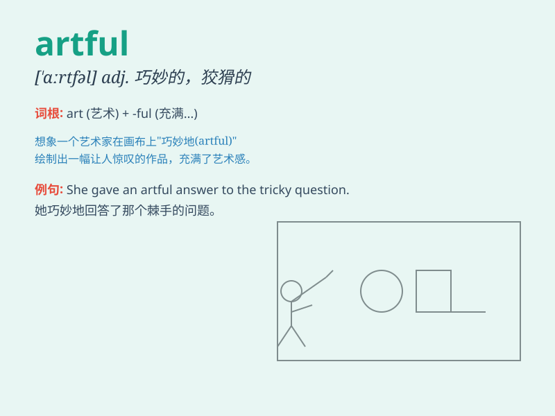

## artful

**英音:** _[\'ɑːtfʊl; -f(ə)l]_ **美音:** _[\'ɑrtfl]_

**译义:** *adj.巧妙的,狡猾的*

### 短语

+ **artful dodge:** _巧妙的逃避；狡猾的躲闪_

+ **artful device:** _巧妙的装置；精巧的手段_

+ **artful persuasion:** _巧妙的劝说；有技巧的说服_

+ **artful trick:** _巧妙的诡计；狡猾的花招_

+ **artful design:** _巧妙的设计；精美的设计_

### 例句

#### 例句1

> **The thief was very artful in avoiding detection.**

**中文翻译:** 小偷非常狡猾地躲避被发现。

**单词释义:** 狡猾的；巧妙的

#### 例句2

> **She gave an artful reply that avoided answering the question
directly.**

**中文翻译:** 她巧妙地回答了问题，避免直接回答问题。

**单词释义:** 巧妙的；狡猾的

#### 例句3

> **The artful design of the garden made it a peaceful retreat.**

**中文翻译:** 花园的巧妙设计使其成为一处宁静的休憩之所。

**单词释义:** 巧妙的；有技巧的

### 背诵小故事

> A painter was very artful. He could create amazing paintings with
ease. One day, a rich man wanted a special portrait. The painter used
all his artful skills and made a masterpiece. The rich man was
impressed.

**一位画家非常有技巧。他能轻松创作出令人惊叹的画作。有一天，一个富人想要一幅特别的肖像画。画家运用他所有巧妙的技巧创作了一幅杰作。富人印象深刻。**

### 图义

